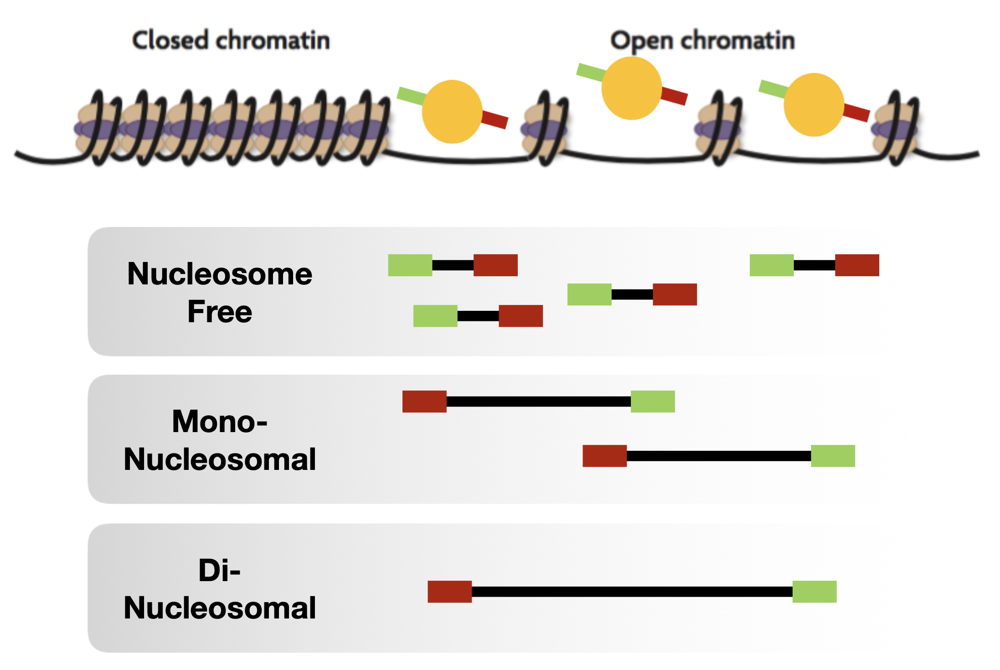
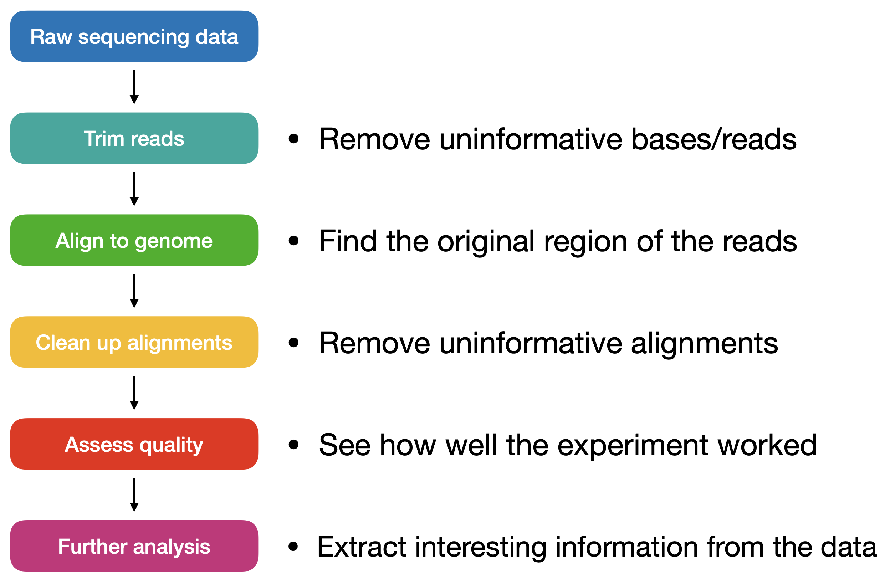
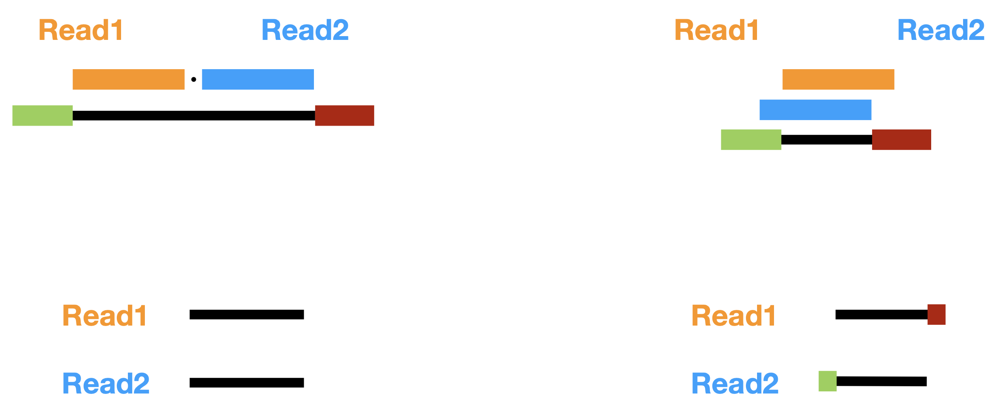
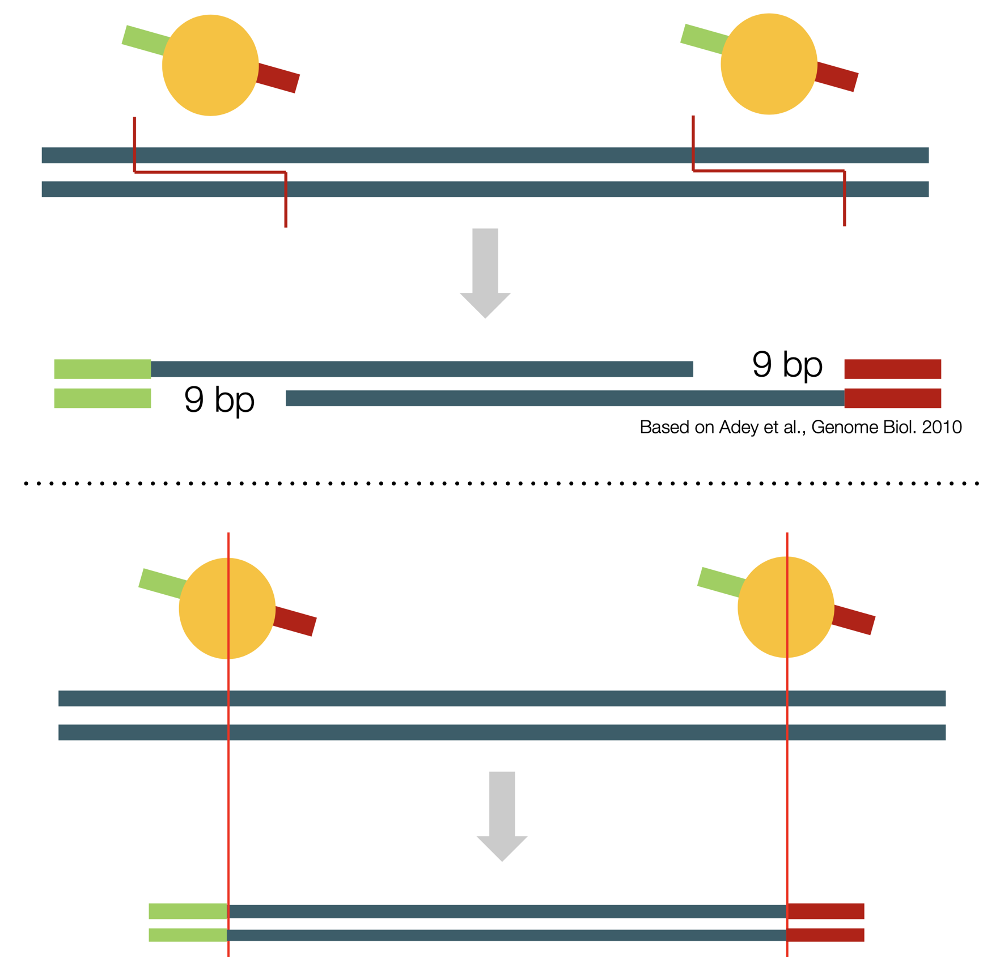
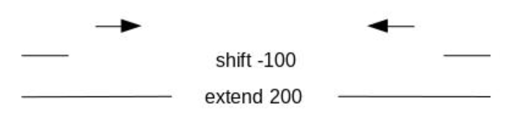

Analysis of ATAC-seq data
===

# Introduction

ATAC-seq (**A**ssay for **T**ransposase-**A**ccessible **C**hromatin using **seq**uencing) is a technique used to assess chromatin accessibility in a genome-wide manner. Compared with alternatives, such as MNaseq-seq or DNase-seq, ATAC-seq has multiple advantages: it requires significantly less input materials and has much shorter preparation times. In addition, it allows assessing regions of open chromatin and nucleosome positions from the same dataset, whereas the other techniques only allow for one or the other.

The advantages of ATAC-seq are based on the usage of an hyperactive mutant Tn5 transposase. In a process called _tagmentation_ (tag + fragmentation), the Tn5 transposases cleaves the DNA double-strand and tags the ends of the cut DNA with sequencing adaptors. This leads to the production of short, double-stranded DNA fragments that have sequencing adaptors on each end. Due to the random nature of Tn5 transposition, fragments can be completely free of nucleosome, or contain 1 or more nucleosome (mono-, di-nucleosomal, etc.). During the analysis we will be able to differentiate these differentiate these different fragment types based on their size and can use them to assess whether we over- or under-transposed. Finally, these fragments are purified, PCR amplified and finally sequenced. 



In this module you will learn how prepare ATAC-seq data, going from raw sequencing reads to calling regions of open chromatin. Along the way you will learn how to control the quality of your data and which special considerations are necessary when working with ATAC-seq data.



# Practical 1: Pre-processing of reads

The first step in every analysis is controlling the quality of your sequencing data. This will allow you to spot any peculiarities of your data that might give you problems during later analysis steps and allow you to deal with them effectively. In addition, we will trim the sequencing data, removing adapter sequences, low-quality bases and other artefacts that complicate mapping the reads.

1) Change directories into the `examples` directory contained in this module

```bash
cd examples
```

2) To avoid accidentally altering or deleting the raw data, remove write permissions from the files

```bash
chmod a-w raw_data/*
```

For quality control, we will be using [`FastQC`](https://www.bioinformatics.babraham.ac.uk/projects/fastqc/). This simple tool will run a number of checks to give you a quick impression of your data and alert you to any problems your data might have.

3) Make sure that `fastqc` is accessible from the command line by running:

```bash
fastqc --version
```

This step is a simple way to test whether a tool is installed and accessible and important for making your analysis replicable: results can often change slightly between different versions of the same tool. Therefore, keeping track of which version you used for your analysis will allow others to replicate your results!

4) To run `fastqc` on your samples:

```bash
mkdir -p data/fastqc/untrimmed/
fastqc -t 4 -o data/fastqc/untrimmed/ raw_data/*
```

Using 4 threads in parallel (one file per thread) `fastqc` will produce quality reports for each file and store them in the `data/fastqc/untrimmed/` directory. One file will be an `.html` file, containing some basic information and plots of the quality metrics. The other will be a `.zip` archive containing the data underlying the report.

5) Open a report in your browser and familiarise yourself with the quality checks.
    - What is the sequence length for your data?
    - Is there a specific trend for the per base sequence quality?
    - What about the per base sequence content?
    - Do you reads have high levels of PCR duplicates?
    - Are the read contaminated with adapter sequences?

To remove any problematic basecalls and other sequencing artefacts, we will run [`fastp`](https://github.com/OpenGene/fastp) a very fast trimming tool. This will perform multiple trimming steps:
- Remove low quality reads
- Trim low quality base calls from the 3' end of reads
- Trim low-complexity and poly-X basecalls
- Remove adapter sequences from the 3' end of reads

Adapter sequences appear at the end of reads when the insert size of a fragment is shorter than the sequencing length of the experiment. In this case, the sequencing does not stop at the end of the insert but instead continues sequencing the adapter at the 3' end. Since the adapter sequence is not part of the genome, this can lead to wrong alignments or preven the read from aligning at all. Therefore, it is important to remove these adapter sequences before continuing to the alignment step. One simple way to do this for paired-end sequencing data is to align read1 to read2 and simply remove any overhangs.



For this to work we need to trim read1 and read2 of the same sample together. Therefore, we cannot iterate over each file by itself, as we did for `fastqc`, but instead need to loop over the sample IDs.

6) Create a list of all sample IDs from the names of the raw sequencing data

```bash
# Create an empty list
SAMPLES=()
# Iterate only over read1 to avoid duplicate sample IDs
for FILE in raw_data/*_1.fastq.gz
do
    # Remove the `_1.fastq.gz` ending using parameter expansion and the
    # directory with the `basename` command, then append to the list
    SAMPLES+=($(basename ${FILE/_1.fastq.gz}))
done
```

6) Run `fastp` for all your samples:

```bash
mkdir -p data/{trimmed,fastp}

for SAMPLE in ${SAMPLES[@]}
do
    fastp --thread 4 --in1 raw_data/${SAMPLE}_1.fastq.gz --in2 raw_data/${SAMPLE}_2.fastq.gz \
        --out1 data/trimmed/${SAMPLE}_1.fastq.gz --out2 data/trimmed/${SAMPLE}_2.fastq.gz \
        -3 --cut_tail_window_size 1 --cut_tail_mean_quality 20 \
        --low_complexity_filter --trim_poly_x --correction --detect_adapter_for_pe \
        --json data/fastp/${SAMPLE}.json --html data/fastp/${SAMPLE}.html
done
```

7) Control quality after trimming with `fastqc`:

```bash
mkdir -p data/fastqc/trimmed/
fastqc -t 4 -o data/fastqc/trimmed/ data/trimmed/*
```

# Practical 2: Alignment of trimmed reads to the genome

After trimming, we use [`Bowtie2`](https://bowtie-bio.sourceforge.net/bowtie2/manual.shtml) to align the short reads to the genome. While `Bowtie2` offers many settings to fine-tune the alignment process, the default options work very well in almost all situations. We only set a few additional options to restrict the alignments that `Bowtie2` will output:
- Limit the fragment size to 2,000bp (or the size of your upper size selection + 200bp)
- Ignore reads that do not align to the genome
- Ignore reads that are not properly paired (only 1 read aligns, or reads that align too far from each other)

Aligners like `Bowtie2` require an index specific to that genome to efficiently align your reads. This index can be constructed with the `bowtie2-build` command, but you can also find a pre-built one for this tutorial at `GRCm38_index`.

1) Align reads with `Bowtie2`:

```bash
for SAMPLE in ${SAMPLES[@]}
do
    mkdir -p data/alignment/${SAMPLE}
    bowtie2 -p 4 --time \
        -1 data/trimmed/${SAMPLE}_1.fastq.gz -2 data/trimmed/${SAMPLE}_2.fastq.gz -x GRCm38_index/GRCm38_index \
        --maxins 2000 --no-mixed --no-discordant --no-unal > data/alignment/${SAMPLE}/${SAMPLE}.sam
done
```

The output of `Bowtie2` are **S**AM files, but we prefer to work with **B**AM files, as they are compressed and therefore take up less space. Converting from SAM to BAM is a straightfoward process during which we can already remove low-quality alignments (this includes multi-mapping reads). For working with SAM/BAM files we can use 2 tools: [`samtools`](https://www.htslib.org/doc/samtools.html) and [`sambamba`](https://lomereiter.github.io/sambamba/). Both can be used interchangeably for most steps, but `sambamba` is slightly faster usually.

2) Convert from SAM to BAM:

```bash
for SAM in data/alignment/*/*.sam
do
    # Use shell parameter expansion to change the ending from '.sam' to
    # '.bam' for the output file
    samtools view -@ 4 -q 10 -b -o ${SAM/.sam/.bam} ${SAM}
done
```

Finally, we sort the alignments by their genomic coordinates. Many analyses require only the subset of reads orignating from a specific genomic position, e.g. loading the alignments into a genome browser. If the data is unsorted this would require searching through all alignments everytime we move our viewing window. Instead, if the data is sorted we only need to search until the last alignment in our viewing window. 

3) Sort the alignments by genomic coordinates:

```bash
for BAM in data/alignment/*/*.bam
do
    sambamba sort --nthreads 4 -m 2G -o ${BAM/.bam/.sorted.bam} ${BAM}
done
```

To allow even faster access to alignments coming from random regions we need to index our BAM files. As the name suggests, this creates an index between genomic regions and the position of alignments from these regions in the BAM file. This can speed up random access by a lot and is required for many tools to work at all. The index is a separate file with the same name as your BAM file and an added `.bai` ending.

> As the index contains the correlation between genomic regiona and alignment position in the BAM file, whenever you modify the structure of the BAM file (i.e. remove alignments) you need to re-index.

4) Index the sorted alignments:

```bash
for BAM in data/alignment/*/*.sorted.bam
do
    sambamba index -t 4 ${BAM}
done
```

# Practical 3: Filtering to remove uniformative and artefactual alignments

After aligning the reads and converting them into BAM files we want to remove reads that are either uninformative or are artefacts of the library preparation and sequencing. Uninformative reads are those coming from the mitochondrial genome which is histone-free and therefore always open and usually not interesting to your research. Artefacts that arise during library preparation are PCR duplicates, as these do not give any additional information and actually bias your results towards regions that PCR-amplify more easily. Another class of duplicates are so-called optical duplicates that arise during sequencing, caused by a single cluster of fragments being interpreted as two or more separate clusters. Both types of duplicates appear the same, as alignments with exactly the same sequence, aligning to exactly the same position.

1) Mark PCR and optical duplicates and then remove them:

```bash
for BAM in data/alignment/*/*.sorted.bam
do
    sambamba markdup --nthreads 4 --show-progress \
    ${BAM} ${BAM/.sorted.bam/.dupmarked.bam}

    # This index will be necessary for `ataqv` later on
    sambamba index -t 4 ${BAM/.sorted.bam/.dupmarked.bam}

    sambamba view --nthreads 4 --filter "not duplicate" --format bam \
    --output-filename ${BAM/.sorted.bam/.noDups.bam} ${BAM/.sorted.bam/.dupmarked.bam}
done
```

2) Remove mitochondrial alignments by filtering based on the name of the reference sequence:

```bash
for BAM in data/alignment/*/*.noDups.bam
do
    sambamba view --nthreads 4 --filter "ref_name != 'chrM'" --format bam \
    --output-filename ${BAM/.noDups.bam/.noM.bam} ${BAM}
done
```

Lastly, we will remove alignment from so-called "blacklisted regions". These are regions that show extremly high signal independent of the experimental setup. For the most used model organisms (human, mouse, worm, fly) these can easily be downloaded. The regions neeeded for this tutorial are found in `blacklisted.bed`.

3) Remove alignments coming from blacklisted regions using [`bedtools`](https://bedtools.readthedocs.io/en/latest/)

```bash
for BAM in data/alignment/*/*.noM.bam
do
    bedtools intersect -abam ${BAM} -b blacklist.bed -v \
    > ${BAM/.noM.bam/.filtered.bam}

    # Index the final filtered BAM file used for further steps
    sambamba index -t 4 ${BAM/.noM.bam/.filtered.bam}
done
```

One final step that is sometimes done is to shift the alignments. Due to the mechanisms by which the Tn5 transpose insert the sequencing adaptors the ends of the sequencing fragments are shifted by 9bp. To center the ends of the alignemnts on the center of the Tn5 binding site, reads need to be shifted by 5/-4bp. But for most analysis this nucleotide resolution is not necessary.



# Practical 4: Quality control of alignments

With our alignments being filtered, we can now assess some additional quality metrics. This includes things like:
- Number of non-duplicate, non-mitochondrial aligned fragments
- Alignment rate
- Library complexity
- Correlation of replicates
- Fragment size distribution
- TSS enrichment

Whereas the first 4 metrics are useful to check for most sequencing experiments, the last 2 metrics (fragment size distribution and TSS enrichment) are especially important to check for ATAC-seq data. 

1) Count the number of sequenced fragments and alignments:

```bash
for SAMPLE in ${SAMPLES[@]}
do
    echo Counts for: ${SAMPLE}
    # The number of sequenced fragments is equal to the number of lines in the fastq
    # divided by 4. Then we double the number, to account for the second reads.
    # Reads before trimming
    echo $(($(zcat raw_data/${SAMPLE}_1.fastq.gz | wc -l) / 4 * 2))

    # Reads after trimming
    echo $(($(zcat data/trimmed/${SAMPLE}_1.fastq.gz | wc -l) / 4 * 2))

    # We can easily count the number of alignments with `sambamba`
    # Directly after alignment
    sambamba view -c data/alignment/${SAMPLE}/${SAMPLE}.bam 2> /dev/null

    # After removing duplicates
    sambamba view -c data/alignment/${SAMPLE}/${SAMPLE}.noDups.bam 2> /dev/null

    # After removing mitochondrial reads
    sambamba view -c data/alignment/${SAMPLE}/${SAMPLE}.noM.bam 2> /dev/null

    # After removing alignments from blacklisted regions
    sambamba view -c data/alignment/${SAMPLE}/${SAMPLE}.filtered.bam 2> /dev/null

    # Print a small separator between samples
    echo "--------"
done
```

From the number of alignments we can calculate the library complexity as the fraction of distinct (non-duplicated) alignments / total alignments. The alignment rate will be part of the output from `Bowtie2`.

2) Estimate the correlation between replicates by calculating the pairwise correlation between samples:

```bash
multiBamSummary bins -p 4 --bamfiles data/alignment/*/*.filtered.bam -out data/bamsummary.npz

mkdir results

plotCorrelation -in data/bamsummary.npz --corMethod pearson --skipZeros --whatToPlot scatterplot -o results/bamcorrelation.png
```

There are a range of tools that allow you to easily assess the fragment size distribution and TSS enrichment. For this practical we will use [`ataqv`](https://github.com/ParkerLab/ataqv), which can produce interactive HTML report you can view in your browser. To calculate the TSS enrichment `ataqv` needs a BED file with the location of all TSSs. Through the power of the command line, we can construct such a file from the included gene annotation file `gencode.vM25.primary_assembly.annotation.gtf.gz`. The perfect tool for this task is [`awk`](https://www.gnu.org/software/gawk/manual/gawk.html) a simple programming language that is perfect at going through tabular data and extracting the info we want.

3) Construct the BED file of all TSSs

```bash
zcat gencode.vM25.primary_assembly.annotation.gtf.gz | \
    awk -v OFS='\t' '$3 == "transcript" { if ($7 == "+") { print $1, $4-1, $4, $12, ".", $7 } else { print $1, $4-1, $4, $12, ".", $7 }}' | \
    tr -d '";' | \
    sort -k1,1 -k2,2n | \
    uniq > GRCm38.tss.bed
```

4) Create `JSON` reports for each sample with `ataqv`

```bash
mkdir -p data/ataqv

for SAMPLE in ${SAMPLES[@]}
do
    ataqv --name ${SAMPLE} \
        --metrics-file data/ataqv/${SAMPLE}.ataqv.json.gz \
        --tss-file GRCm38.tss.bed \
        mouse \
        data/alignment/${SAMPLE}/${SAMPLE}.dupmarked.sorted.bam
done
```

5) Combine all `.json` reports into the `.html` report

```bash
mkarv results/ataqv_report data/ataqv/*
```

6) Open the interactive report in your browser

```bash
xdg-open results/ataqv_report/index.html
```

# Practical 5: Converting alignments into coverage tracks for visualization

With all basic analysis steps done and after having checked the quality of our data we can finally have a look at our data in a genome browser. For this we could use the final BAM files, but this has 2 big drawbacks:
- BAM files tend to contain a lot of information not needed for visualising the signal, making the files quite big
- Signal strength directly depends on sequencing depth, making comparisons between samples difficult

To solve these problems we can convert our alignments into simpler coverage tracks that only contain information on how strong the signal is at a specific point in the genome. In addition, this allows us to scale the signal based on the sequencing depth, making samples more comparable.  
For this step we will use one of [`Deeptools`](https://deeptools.readthedocs.io/en/latest/) many useful tools: `bamCoverage`. 

1) Convert your `BAM` files into `bigWig` files:

```bash
mkdir -p data/coverage

for SAMPLE in ${SAMPLES[@]}
do
    bamCoverage -p 4 --binSize 5 \
    --normalizeUsing CPM \
    --ignoreForNormalization chrX chrY \
    --bam data/alignment/${SAMPLE}/${SAMPLE}.filtered.bam -o data/coverage/${SAMPLE}.all.bw
done
```

This will create coverage tracks of all alignments, summarising the signal into bins of 5bp and normalising it using **C**ounts **P**er **M**illion (CPM). With this normalisation strategy, a signal of 1 means you would expect to find 1 alignment at this position for every 1 Million alignments in your sample.

But as you remember, depending on the size of the sequencing fragment it contains different information, e.g. whether we have a nucleosome free region (NFR) or mono-nucleosomes. Luckily `bamCoverage` has options to filter alignments by size before creating the coverage tracks. With those, we can create coverage tracks for just the NFR or mono-nucleosomal alignments.

2) Create coverage tracks for the NFR (fragment length < 147bp):

```bash
for SAMPLE in ${SAMPLES[@]}
do
    bamCoverage -p 4 --binSize 5 \
    --normalizeUsing CPM \
    --ignoreForNormalization chrX chrY \
    --extendReads \
    --maxFragmentLength 135 \
    --bam data/alignment/${SAMPLE}/${SAMPLE}.filtered.bam -o data/coverage/${SAMPLE}.nfr.bw
done
```

3) Create coverage tracks for mono-nucleosomal regions (147bp < fragment length < 294 bp):


```bash
for SAMPLE in ${SAMPLES[@]}
do
    bamCoverage -p 4 --binSize 5 \
    --normalizeUsing CPM \
    --ignoreForNormalization chrX chrY \
    --extendReads \
    --minFragmentLength 150 \
    --maxFragmentLength 290 \
    --bam data/alignment/${SAMPLE}/${SAMPLE}.filtered.bam -o data/coverage/${SAMPLE}.mono.bw
done
```

4) Visualize your coverage tracks in the `IGV` genome browser. You can open `IGV` through it's application or the command below

```bash
# In a new terminal tab/window
igv
```

# Practical 6: Calling regions of open chromatin (and nucleosomes)

One very common question for ATAC-seq data is to identify regions of open chromatin. This translates to finding regions where our reads pile up. In theory, this process is very similar to calling peaks, for example when analysing CUT&RUN data. Because of this, many people use peak callers originally developed for ChIP-seq data, with minor adaptions to make them work on ATAC-seq data. One often used peak caller is [`MACS2/3`](https://github.com/macs3-project/MACS). As it is not developed for ATAC-seq data it is not aware of the difference between nucleosome-free and nucleosomal fragments. Therefore, instead of calling peaks at the fragment level, we instead call peaks for each reads individually. The start of each read corresponds to the Tn5 binding sites and always indicates open chromatin, independent of the fragment type.

Instead of letting `MACS2/3` build a model, like it would for ChIP-seq data, we instead center the reads on the 5' end of each read by shifting them back 75bp and extending them to be 150bp long.



1) Call regions of open chromatin for each sample with `MACS2/3`

```bash
for SAMPLE in ${SAMPLES[@]}
do
macs3 callpeak \
    -t data/alignment/${SAMPLE}/${SAMPLE}.filtered.bam -n ${SAMPLE} \
    --outdir data/peaks/${SAMPLE} \
    -f BAM -g mm -q 0.05 \
    --nomodel --shift -75 --extsize 150 \
    --keep-dup all -B
done
```

2) Visualize and confirm the correctness of your peak calls by comparing them to the coverage tracks in `IGV`

Another (supposedly better, but more complicated) route is to use a tool developed specifically for ATAC-seq data, called `HMMRATAC`. It will take our alignments as input and call not only regions of open chromatin but is also able to detect the flanking nucleosomal regions. If you feel adventurous you can try the following steps.

3) Before calling actual regions of open chromatin, it is highly recommended to run a cutoff analysis first. This will allow us to pick optimal values for the 3 cutoffs:
    - `-u, --upper`: Upper limit on fold change range for choosing training sites. Should capture some extremly high enrichment and unusually wide peaks
    - `-l, --lower`: Lower limit on fold change range for choosing training sites. Should capture moderate number of peaks with normal width
    - `-c, --prescan-cutoff`: Fold change cutoff for prescanning candidate regions in the whole dataset. Should capture large number of possible peaks with normal width

```bash
mkdir data/peaks/${SAMPLE}
macs3 hmmratac -i data/alignment/${SAMPLE}/${SAMPLE}.filtered.bam -n ${SAMPLE} --outdir data/peaks/${SAMPLE} --cutoff-analysis-only
```

Once the cutoff analysis is done, have a look at the report to determine the optimal values for `-l`, `-u` and `-c`.

4) Run `HMMRATAC` on your alignments, using the cutoffs determined:

```bash
macs3 hmmratac -i data/alignment/${SAMPLE}/${SAMPLE}.filtered.bam -n ${SAMPLE} --outdir data/peaks/${SAMPLE} -l ${LOWER} -u ${UPPER} -c ${PRESCAN}
```

# Further analyses

At this point you should have all the basic files that allow you to visualize your data so you can assess the landscape of open chromatin in your samples. This can be simpler analyses, for example:
- Comparing the extent of open chromating around 1 or more regions of interest using the bigWig coverage tracks and a genome browser
- Showing the number and overlap of regions of open chromatin along a time course of samples using the GappedPeak/BED peaks
- Creating heatmaps that show the extent of open chromatin around many regions of interest, e.g. promoters, enhancers or the peaks you called before
- And more!

Besides those analyses that are rather straightfoward, there are also more involved techniques, such as transcription factor footprinting. This approach makes use of the fact that DNA binding proteins (like transcription factors) binding to open chromatin make the DNA inaccessible to the Tn5 transposase. Therefore, by looking for 'indents' in peaks of open chromatin (so-called footprints) and checking for TF binding motifsn within, we can infer whether a TF was bound at that position. One popular tool for looking at these footprints is [`TOBIAS`](https://github.com/loosolab/TOBIAS), which makes this type of analysis very easy.
