Analysing Hi-C matrices
================

<!-- hic_feature_analyses.md is generated from hic_feature_analyses.Rmd. Please edit that file -->

This
[tutorial](https://vaquerizaslab.github.io/fanc/fanc-executable/fanc_analyse_hic.html)
assumes that you have gone through the [hic_matrix_generation
tutorial](https://github.com/WCSCourses/Low_Input_2024/blob/main/Modules/hic_matrix_generation/hic_matrix_generation.md)
or followed the [Getting started
instructions](https://fan-c.readthedocs.io/en/latest/getting_started.html#example-fanc-auto)
from the FAN-C documentation.

# Practical 1: [Distance decay of expected contact probability or P(s) curve](https://vaquerizaslab.github.io/fanc/fanc-executable/fanc-analyse-hic/oe.html#expected-values)

The contact intensity in a Hi-C matrix gets progressively weaker the
further apart two loci are. The expected values follow a distinctive
profile with distance for Hi-C matrices, which can be approximated by a
power law and forms an almost straight line in a log-log plot.

1)  To calculate the expected values of any FAN-C compatible matrix, you
    can use the `fanc expected` command on juicer, cooler or fan-c
    matrices:

``` r
cd ~/examples/
fanc expected -p \
  architecture/expected/fanc_example_500kb_expected.png \
  -c chr19 \
  output/hic/binned/fanc_example_500kb.hic \
  architecture/expected/fanc_example_500kb_expected.txt
```

<center>

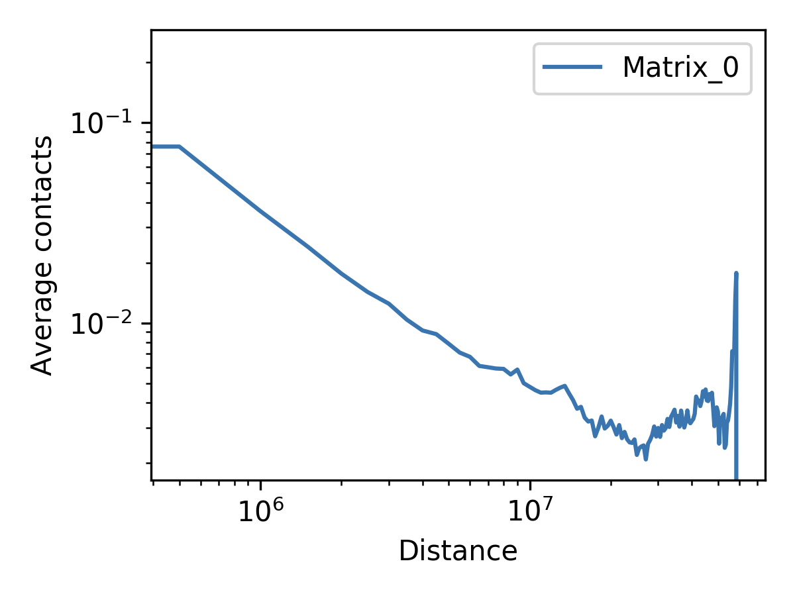

</center>

The raw expected values are stored in `fanc_example_500kb_expected.txt`

``` r
      less architecture/expected/fanc_example_500kb_expected.txt 

      distance    Matrix_0
      0   0.24442297400748084
      500000      0.07759323503191953
      1000000     0.03699383283713825
      1500000     0.02452933204893787
      2000000     0.017725227895561607
      2500000     0.014272302693312262
      3000000     0.011708011997703627
      3500000     0.010125456912234796
      ...
```

It is advisable to run the `fanc expected` command before the steps
below so that the calculated values are stored in the `.hic` object for
future reference. Expected contact frequencies away from the diagonal
will be contrasted with the observed values at each position to estimate
enrichments over background. Use `--recalculate` to force a
re-calculation of expected values, for whatever reason. Use `-N` to plot
the un-normalised expected values.

2)  We can calculate the expected value of multiple matrices at the same
    time in this way:

``` r
fanc expected \
  -l "HindIII 5M" "HindIII 100k" \
  "MboI 1M" "MboI 100k" "MboI 50k" -c chr19 \ 
  -p architecture/expected/expected_multi.png \
  architecture/other-hic/lowc_hindiii_5M_1mb.hic \
  architecture/other-hic/lowc_hindiii_100k_1mb.hic \
  architecture/other-hic/lowc_mboi_1M_1mb.hic \
  architecture/other-hic/lowc_mboi_100k_1mb.hic \
  architecture/other-hic/lowc_mboi_50k_1mb.hic \
  architecture/expected/expected_multi.txt
```

3)  Having pre-calculated expected values, we can easily plot
    observed/expected matrices that highlight Hi-C interaction patterns
    more easily. Here, we are showing a log2-transformed O/E matrix:

``` r
fancplot \
  -o architecture/expected/fanc_example_500kb_chr18_oe.png \
  chr18:1-78mb -p triangular \
  -e output/hic/binned/fanc_example_500kb.hic \
  -vmin -2 -vmax 2
```

<center>

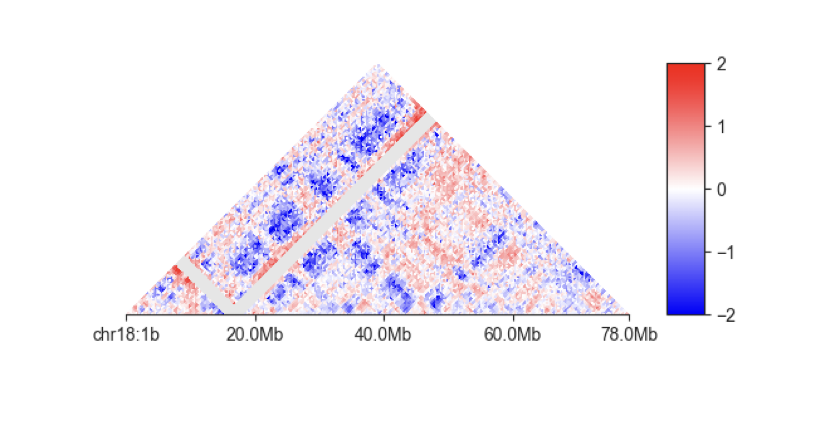

</center>

4)  Which layers of genome folding do you see in this picture?

# Practical 2: [AB compartment analysis](https://fan-c.readthedocs.io/en/latest/fanc-executable/fanc-analyse-hic/ab_compartments.html#ab-compartment-analysis)

Regions in a Hi-C matrix can generally be assigned to either the
‘active’ or the ‘inactive’ compartment, also called ‘A’ and ‘B’
compartments, respectively. The traditional way of calling compartments
aims to enhance the plaid or chess-like pattern in the Hi-C matrix to
identify regions that interact in similar ways to each other.

## Correlation matrix

This is first achieved by calculating an (auto) correlation matrix in
which each entry `i`,`j` corresponds to the Pearson correlation between
row `i` and column `j` of the Hi-C matrix.

1)  The `fanc compartments` command can produce a correlation matrix (AB
    compartment object) from a FAN-C matrix file. Example:

``` r
fanc compartments \
  output/hic/binned/fanc_example_1mb.hic \
  architecture/compartments/fanc_example_1mb.ab
```

By default, compartment matrices are calculated on a per-chromosome
basis, since each chromosome might be normalised differently and is hard
to estimate expected values inter-chromosomally. To force the AB
calculation on the whole genome, use the `-w` option.

2)  We can easily plot the correlation matrix using the `fancplot`
    command:

``` r
fancplot \
  -o architecture/compartments/fanc_example_1mb.ab.png chr18 \
  -p square architecture/compartments/fanc_example_1mb.ab \
  -vmin -0.75 -vmax 0.75 -c RdBu_r
```

<center>

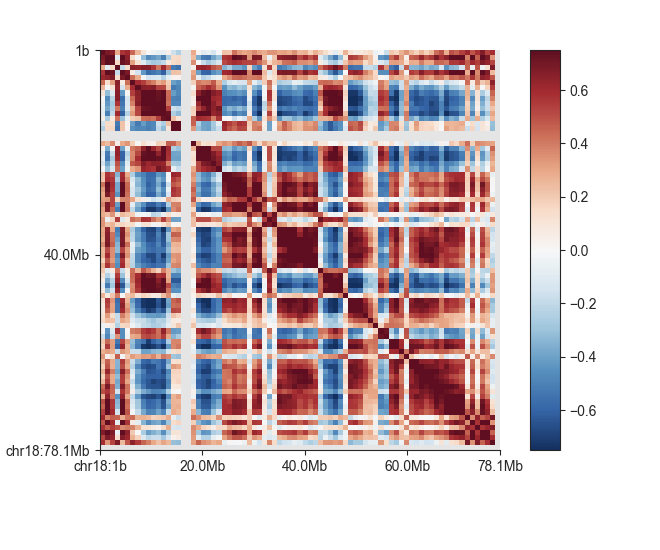

</center>

## AB Eigenvector

To translate this enhanced chess-like pattern into a 1-dimension bed
file that captures the binary nature of the correlation we typically use
a PCA decomposition and keep the first eigenvector to calculate
compartments. The eigenvector of the correlation matrix is used to
derive compartment type and strength for each matrix bin. Generally,
regions with positive values are assigned the ‘A’, regions with negative
values the ‘B’ compartment.

3)  To calculate the eigenvector in addition to the correlation matrix,
    simply add the `-v <file_name>` option to the previous command:

``` r
fanc compartments \
  -v architecture/compartments/fanc_example_1mb.ev.txt \
  output/hic/binned/fanc_example_1mb.hic \
  architecture/compartments/fanc_example_1mb.ab
```

If `architecture/compartments/fanc_example_1mb.ab` already exists, it
will not be recalculated but the matrix is loaded from file. You can use
the `-f` option to overwrite the existing file in any case.

4)  We can plot the eigenvector using fancplot:

``` r
fancplot \
  -o architecture/compartments/fanc_example_1mb.ab_and_ev.png \
  chr18 \
  -p square architecture/compartments/fanc_example_1mb.ab \
  -vmin -0.75 -vmax 0.75 -c RdBu_r \
  -p line architecture/compartments/fanc_example_1mb.ev.txt
```

<center>

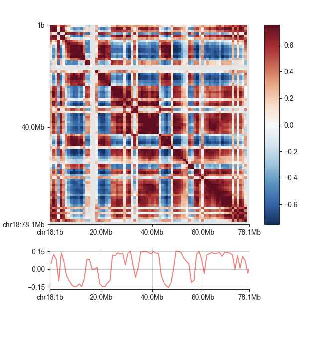

</center>

NOTE: `fanc compartments` outputs the first eigenvector by default. In
some cases (like organisms with non-acrosomal chromosomes) it might be
useful to choose a different eigenvector (sometimes the first
eigenvector identifies chromosomal arms rather than compartments). To
change the eigenvector use the `-i` option, e.g. `-i 2` to keep the
second instead of the first correlation matrix eigenvector.

5)  The sign of the eigenvector does not necessarily correspond well to
    the A or B compartment. Often, the eigenvector is “flipped”
    (inverted signs on its entries). Mathematically, if `x` is an
    eigenvector, so is `-x`. You can use external information to
    “orient” the eigenvector, so that it most likely corresponds to the
    active and inactive compartments.

Specifically, you can supply a `FASTA` file with the genomic sequence to
fanc compartments using the `-g <fasta_file>` argument. This is
generally a good idea: fanc compartments then calculates the average GC
content of regions with positive and those with negative eigenvector
entries. As GC content has previously been shown to correlate well with
compartmentalisation, the eigenvector is oriented in such a way that
negative entries correspond to ‘B’ (low GC content) and positive entries
to ‘A’ (high GC content).

``` r
fanc compartments \
  -g hg19_chr18_19.fa \
  -v architecture/compartments/fanc_example_1mb.ev_gc.txt \
  architecture/compartments/fanc_example_1mb.ab 
```

## AB Domains

Consecutive matrix bins with the same eigenvector sign are considered
part of a “domain”.

6)  You can use the `-d <domain_file>` option to write the AB domains to
    a `BED` file:

``` r
fanc compartments -g hg19_chr18_19.fa \
  -d architecture/compartments/fanc_example_1mb.domainsgc.bed \
  architecture/compartments/fanc_example_1mb.ab
```

The domains `BED` file merges all consecutive bins in the same domain,
which is why A and B are always alternating. It contains the domain type
in the “name” field and the average eigenvector entry values of all bins
in the domain in the “score” field:

## AB Enrichment profiles or ‘Saddle plots’

A useful way of displaying genome-wide changes at the compartment-level
is to calculate average interaction frequencies between regions of the
genome that have different compartmental values. i.e. To answer the
question: How many interactions are there between A-A regions? how many
interactions are there between B-B regions of the genome? and how many
interactions occur across compartments (A-B)? Is there a change of
overall compartmentalisation between conditions?

The compartmentalisation of a genome can be visualised in an enrichment
profile plot. This will divide bins into percentiles using the
associated eigenvector values, and then the average observed/expected
(O/E) values of contacts in each pair of percentile bins is calculated
and plotted.

6)  Use the `-e <plot_file>` option to generate this plot. You can also
    use the `-m <matrix_file>` option to output the enrichment matrix
    values to file for further analysis.

``` r
fanc compartments -g hg19_chr18_19.fa \
  -e architecture/compartments/fanc_example_1mb.ab_profile.png \
  output/hic/binned/fanc_example_1mb.hic \
  architecture/compartments/fanc_example_1mb.ab
```

This process will need to specify the `.hic` matrix to calculate the
enrichment of the contacts over the expected values. It is also advised
to use a `FASTA` genome file to correctly orient the compartments.

<center>

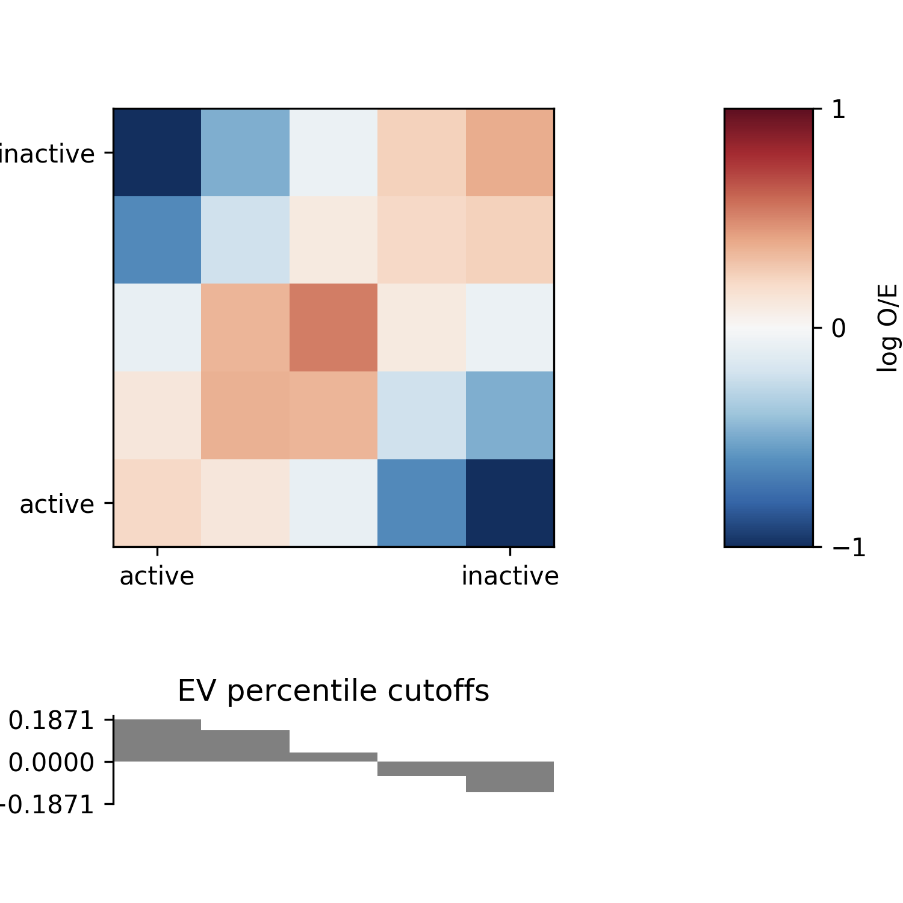

</center>

7)  You can customise the enrichment analysis using additional
    parameters. By default, the percentiles for eigenvector binning are
    chosen at 20, 40, 60, 80, and 100. To choose a finer binning, for
    example, you can use `-p 10 20 30 40 50 60 70 80 90 100`. The “0”
    percentile is always added automatically. The eigenvector values are
    not necessarily centred around 0, which can lead to some unexpected
    enrichment plots. To force the central enrichment matrix bin to 0,
    and perform separate percentile calculations for values \< 0 and \>=
    0, use the `-s 0` option. Note, however, that this will lead to
    differences in the number of bins plotted on the left and right side
    of the matrix.

<center>

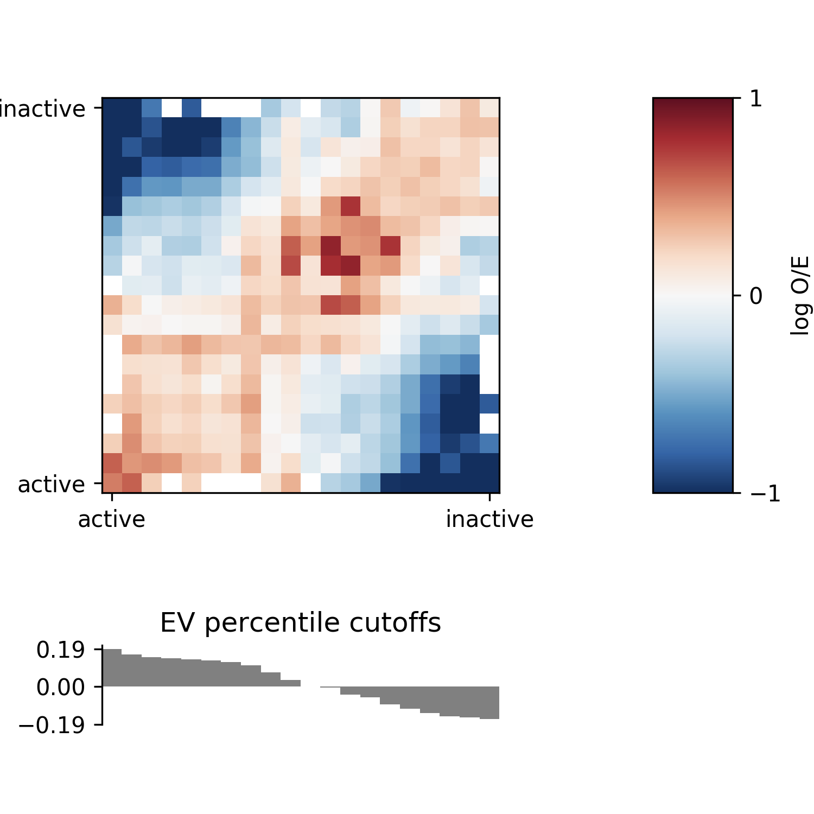

</center>

8)  Compartment stength as defined by [Flyamer, Gassler, and Imakaev et.
    al 2017](https://pubmed.ncbi.nlm.nih.gov/28355183) can be calculated
    using `--compartment-strength <filename>`. It is defined in their
    supplement as follows “\[In a 5x5 compartment enrichment map, \] “to
    calculate the strength of compartment signal, we took the natural
    logarithm of the AA \* BB / AB^2”.

# Practical 3: PCA Analysis

When working with multiple Hi-C libraries, it is often useful to assess
the variability between replicates and samples from different
conditions. This can provide valuable information about potential
experimental biases and whether samples from different replicates can be
safely merged.

As an example, we ran a PCA analysis on the 1mb resolution mESC Hi-C
matrices from our [Low-C
paper](https://www.nature.com/articles/s41467-018-06961-0)(Díaz et al.,
Nat. Comms. 2018) using different restriction enzymes (MboI and
HindIII), as well as different input cell numbers.

``` r
fanc pca -n "HindIII 100k" "HindIII 5M" \
  "MboI 100k" "MboI 1M" "MboI 50k" \
     -Z -s 100000 -r chr19 -p architecture/pca/lowc.pca.png \
     architecture/other-hic/lowc_hindiii_100k_1mb.hic \
     architecture/other-hic/lowc_hindiii_5M_1mb.hic \
     architecture/other-hic/lowc_mboi_100k_1mb.hic \
     architecture/other-hic/lowc_mboi_1M_1mb.hic \
     architecture/other-hic/lowc_mboi_50k_1mb.hic \
     architecture/pca/lowc.pca
```

<center>

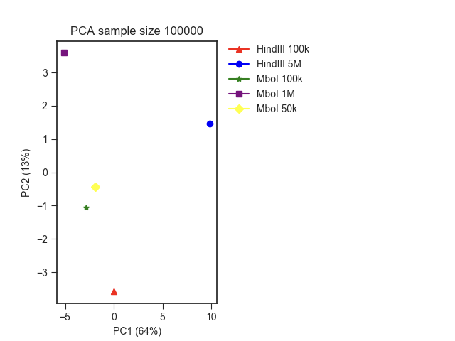

</center>

By default, PCA is run on pixels across the whole genome. In the example
above, we have restricted the analysis to chromosome 19 using the
`-r chr19` argument. `-Z` instructs fanc pca to use only non-zero matrix
entries for the PCA - this can help mitigate the effect of very weak
contacts on the variability.

Is run by default on the s most variable pixels in the Hi-C matrix. You
can change which pixels get used for the PCA by changing
`--strategy fold-change` to choose contacts with the largest fold-change
or `--strategy passthrough` to make no prior selection of contacts. If
you only want to include contacts up to (or above a) a certain distance,
you can specify that distance using the `--max-distance` (or
`--min-distance`) option.

# Practical 4: TAD boundaries and TADs

Like compartments, topologically associating domains, or TADs, for a
fundamental level of genome organisation.

``` r
fancplot \
  -o architecture/domains/fanc_example_100kb_tads.png \
  chr18:18mb-28mb \
  -p triangular output/hic/binned/fanc_example_100kb.hic \
  -m 4000000 -vmin 0 -vmax 0.05
```

<center>

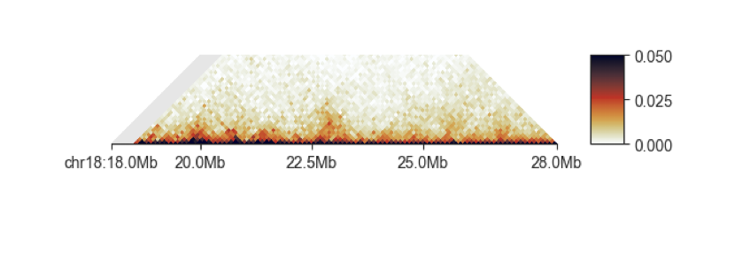

</center>

FAN-C provides multiple “scores” that are designed to find the
boundaries between domains.

## Insulation Score

The insulation score ([Crane et
al. 2015](https://www.nature.com/articles/nature14450)) adds up contacts
in a sliding diamond window along the Hi-C matrix diagonal.

<center>

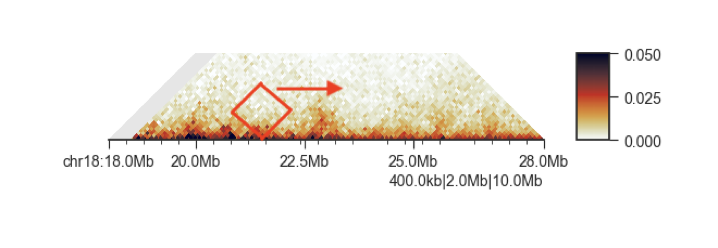

</center>

Regions with low score are “insulating”, i.e. regions between domains.
Regions with high scores are most likely found inside domains.

1)  `fanc insulation` is typically used to calculate insulation scores
    with multiple window sizes at the same time, as a single window size
    might be prone to local matrix differences:

``` r
fanc insulation output/hic/binned/fanc_example_100kb.hic \
  architecture/domains/fanc_example_100kb.insulation \
  -w 1000000 1500000 2000000 2500000 3000000 3500000 4000000
```

<center>

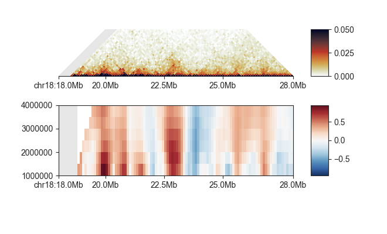

</center>

2)  We can easily plot all insulation scores at the same time using
    `fancplot`:

``` r
fancplot \
  -o architecture/domains/fanc_example_50kb_tads_insulation.png \
  chr18:18mb-28mb \
  -p triangular output/hic/binned/fanc_example_100kb.hic \
  -m 4000000 -vmin 0 -vmax 0.05 \
  -p scores architecture/domains/fanc_example_100kb.insulation
```

3)  We can additionally obtain `.bed` files, `.gff` files or `.bigwig`
    files for display in other genome browsers:

``` r
fanc insulation output/hic/binned/fanc_example_100kb.hic \
  architecture/domains/fanc_example_100kb.insulation \
  -w 1000000 1500000 2000000 2500000 3000000 3500000 4000000 \
  -o bed
```

Which will generate multiple bed files:

``` r
ls architecture/domains/*.bed
architecture/domains/fanc_example_100kb.insulation_1.5mb.bed
architecture/domains/fanc_example_100kb.insulation_1mb.bed
architecture/domains/fanc_example_100kb.insulation_2.5mb.bed
architecture/domains/fanc_example_100kb.insulation_2mb.bed
architecture/domains/fanc_example_100kb.insulation_3.5mb.bed
architecture/domains/fanc_example_100kb.insulation_3mb.bed
architecture/domains/fanc_example_100kb.insulation_4mb.bed
```

4)  You can then plot scores from one or more window sizes using the
    line plot in fancplot:

``` r
fancplot --width 6 \
  -o architecture/domains/fanc_example_100kb_tads_insulation_1mb.png \
  chr18:18mb-28mb \
  -p triangular output/hic/binned/fanc_example_100kb.hic \
  -m 4000000 \
  -vmin 0 -vmax 0.05 \
  -p line architecture/domains/fanc_example_100kb.insulation_1mb.bed \
          architecture/domains/fanc_example_100kb.insulation_2mb.bed \
  -l "1mb" "2mb"
```

<center>

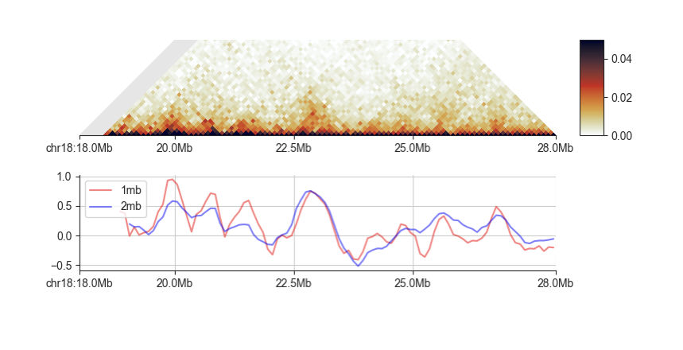

</center>

By default, insulation scores are normalised to the chromosomal average
and then log-transformed. There are plenty of normalisation and
imputation strategies for insulation index calculations. Please refer to
our [Normalisation
help](https://fan-c.readthedocs.io/en/latest/fanc-executable/fanc-analyse-hic/domains.html#normalisation)
for further details.

## Insulating boundaries (TAD boundaries)

Regions in the genome where the insulation score reaches a local minimum
represent the region between two self-interacting domains, or TADs. You
can use fanc boundaries to identify these regions.

5)  When we run fanc boundaries on the above example using 1mb and 2mb
    as the window sizes:

``` r
fanc boundaries \
  architecture/domains/fanc_example_100kb.insulation \
  architecture/domains/fanc_example_100kb.insulation_boundaries \
  -w 1mb 2mb
```

We get two output files with all insulation score minima and associated
scores (the depth of the minimum compared to the two neighbouring
maxima).

6)  Let’s plot the boundaries from the 1mb scores:

``` r
fancplot --width 6 \
  -o architecture/domains/fanc_example_100kb_insulation_1mb_boundaries.png \
  chr18:18mb-28mb \
  -p triangular output/hic/binned/fanc_example_100kb.hic \
  -m 4000000 -vmin 0 -vmax 0.05 \
  -p line architecture/domains/fanc_example_100kb.insulation_1mb.bed \
  -l "1mb" \
  -p bar architecture/domains/fanc_example_100kb.insulation_boundaries_1mb.bed
```

<center>

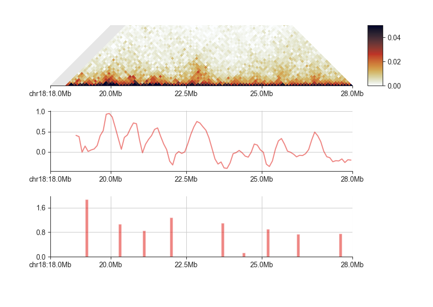

</center>

7)  As you can see, lower minima get higher scores. By default, fanc
    boundaries outputs all minima, but you may set a threshold using
    `--min-score <s>` to report only boundaries with scores greater than
    `s`.

``` r
fanc boundaries \
  architecture/domains/fanc_example_100kb.insulation \
  architecture/domains/fanc_example_100kb.insulation_boundaries_score0.7 \
  -w 1mb 2mb --min-score 0.7
```

Note that the output of this analysis depends on the window size and
thresholds that you decide to use. We recommend trying a few
combinations and only use a set of ‘reproducible’ boundaries to avoid
technical issues. In general, we also recommend annotating the
boundaries with the respective insulation score to be able to compare
quantitatively the scores called with the same window size and
thresholds across conditions.

## Directionality Index

The directionality index ([Dixon et
al. 2012](https://www.nature.com/articles/nature11082)) measures the
bias in contact frequency up- and downstream of an Hi-C region. When
inside TADs, this measure tends towards zero, as interactions in either
direction are equally frequent. However, when approaching a TAD boundary
this measure changes drastically, as one direction will remain inside
the TAD, where there is a high contact intensity, whereas the other
direction will lie in a low intensity region outside the TAD.

8)  `fanc directionality` is very similar in syntax to
    `fanc insulation`. It is typically used to calculate directionality
    indexes with multiple window sizes at the same time, as a single
    window size might be prone to local matrix differences:

``` r
fanc directionality \
  output/hic/binned/fanc_example_100kb.hic \
  architecture/domains/fanc_example_100kb.directionality \
  -w 1000000 1500000 2000000 2500000 3000000 3500000 4000000
```

9)  We can easily plot all directionality indexes at the same time using
    fancplot:

``` r
fancplot \
  -o architecture/domains/fanc_example_100kb_tads_directionality.png \
  chr18:18mb-28mb \
  -p triangular output/hic/binned/fanc_example_100kb.hic \
  -m 4000000 -vmin 0 -vmax 0.05 \
  -p scores architecture/domains/fanc_example_100kb.directionality
```

<center>

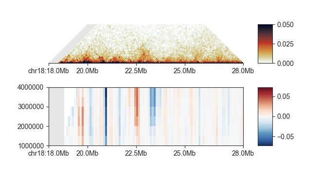

</center>

## TAD calling

FAN-C does not provide a TAD calling functionality itself as there are
plenty of tools available that specialise on this topic. We ourselves
have developed a tool to call TADs called
[tadtool](https://github.com/vaquerizaslab/tadtool) with an interactive
display for users to have the opportunity to decide on their parameters
based on what looks appropriate visually.

However, we would like to point out that TAD calling algorithms often
depend critically on their input parameters, and different TAD callers
can lead to very different results. So, we encourage the use of multiple
TAD calls or TADs called with multiple parameter combinations with a
quantitative annotation of TAD strength.

10) To explore what’s is the effect of different parameters on TAD
    calling using tadtool we can use this example:

``` r
# Installing TADtool
git clone https://github.com/vaquerizaslab/tadtool.git
cd tadtool
python setup.py install
tadtool –help
```

``` r
# Example locus
tadtool plot \
  examples/chr12_20-35Mb.matrix.txt \
  examples/chr12_20-35Mb_regions.bed \
  chr12:31000000-33000000
```

<center>

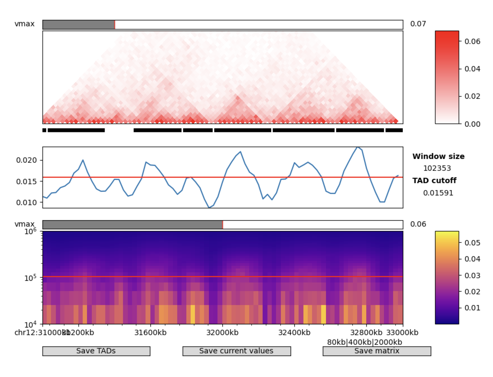

</center>

# Practical 5: Loop calling

Loops frequently form between two genomic regions, and are visible in
the Hi-C matrix as patches of increased contact intensity:

``` r
fancplot \
  -o architecture/loops/rao2014.chr11_77400000_78600000.png \
  chr11:77400000-78600000 \
  -p triangular architecture/loops/rao2014.chr11_77400000_78600000.hic \
  -vmin 0.0 -vmax 0.05 -m 600000
```

<center>

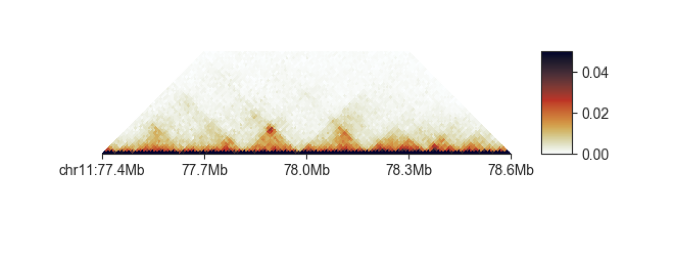

</center>

We can use `fanc loops` to call loops in Hi-C matrices using the HICCUPS
algorithm ([Rao and Huntley et al.,
2014](https://www.cell.com/fulltext/S0092-8674(14)01497-4)). Please
refer to the original paper for details on the algorithm, specifically
the different types of local neighbourhoods defined to make loop calling
robust.

In FAN-C this process consists of three steps:

- Annotating pixels for loop calling

- Filtering annotated pixels

- Merging unfiltered pixels into loops

## Annotating pixels for loop calling

1)  The first step in HICCUPS consists of annotating each pixel with
    various measures related to their loop probability. The most
    important ones are: Enrichment over expected values in the local
    neighbourhood False Discovery Rate (FDR) of the local enrichment
    Mappability of the local neighbourhood

``` r
fanc loops \
  architecture/loops/rao2014.chr11_77400000_78600000.hic \
  architecture/loops/rao2014.chr11_77400000_78600000.loops \
  -t 2
```

This is the most computationally expensive step. We recommend large
number of threads using the `-t` option. If you have access to a
computational cluster running Sun/Oracle Grid Engine, you can take
advantage of it by automatic job submission setting the `--sge` flag.

By default, `fanc loops` assumes a loop size of 25kb. This determines
the area around a pixel that is not included in the local neighbourhood
calculations. If this is chosen too small, the neighbourhood will lie
within the peak region, and enrichments are going to be lower. If this
is chosen too big, the neighbourhood will no longer be local. If you
have reason to believe your loops size differs from the default, you can
set it explicitly with `-p`.

Similarly, the width of the neighbourhood is determined as `p + 3` by
default. If you want to in- or decrease the neighbourhood width, use the
`-w` parameter. You should know, however, that this is just a starting
value, and the neighbourhood width might be increased on demand
internally.

Finally, you can control the size of the submatrices sent to each thread
using the `--batch-size` parameter. The default, 200, should suit most
purposes, but if your individual jobs are taking too long, you should
reduce this number.

We can now use the output object with annotated pixels for downstream
processing.

## Filtering annotated pixels

We need to apply filters to the annotated pixel object that remove all
pixels with a low probability of being a loop. These filters typically
consist of enrichment filters, FDR filters, and mappability filters.
Additionally, there are filters for minimum distance between regions,
and the minimum number of unnormalised valid pairs in a pixel.

You can either set a global enrichment filter that acts on all
neighbourhoods using `-e`, or choose individual thresholds for each
local neighbourhood with `--enrichment-donut`, `--enrichment-vertical`,
`--enrichment-horizontal`, and `--enrichment-lower-left`. You usually
want to set at least the `--enrichment-donut` cut-off to something like
2.

For FDR values, also called q-values, you can set a global filter using
`-q`. Control the filtering of individual neighbourhoods using
`--fdr-donut`, `--fdr-vertical`, `--fdr-horizontal`, and
`--fdr-lower-left`. Typical values for each neighbourhood are around
0.1.

Mappability filters act on pixels where a certain fraction of pixels in
their local neighbourhoods is unmappable. To set a global mappability
cut-off for all neighbourhoods, use the `-m` option. Again, local
neighbourhood mappability filters can be fine-tuned using the
`--mappability-donut`, `--mappability-vertical`,
`--mappability-horizontal`, and `--mappability-lower-left` options.

It is generally a good idea to filter on the minimum distance between
regions to consider forming a loop, as a lot of false positive loops
will be close to the diagonal. You can use the `-d <b>` parameter to set
a threshold on the minimum distance, where b is expressed in number of
bins.

In addition, we highly recommend applying a filter on the minimum number
of valid pairs in a pixel (`-o`), so that false-positive loops due to
noise are avoided.

For convenience, we have included the filter applied by [Rao and Huntley
et al. 2014](https://www.cell.com/fulltext/S0092-8674(14)01497-4) in
their original HICCUPS algorithm as a convenient pre-set `--rh-filter`.
It only retains peaks that are at least 2-fold enriched over either the
donut or lower-left neighbourhood, at least 1.5-fold enriched over the
horizontal and vertical neighbourhoods, at least 1.75-fold enriched over
both the donut and lower-left neighbourhood, and have an FDR \<= 0.1 in
every neighbourhood.

2)  Using the filters defined by [Rao and Huntley et al,
    2014](https://www.cell.com/fulltext/S0092-8674(14)01497-4)

``` r
fanc loops \
  architecture/loops/rao2014.chr11_77400000_78600000.loops \
  architecture/loops/rao2014.chr11_77400000_78600000_filtered.loops \
  --rh-filter -d 5 -o 5
```

## Merging unfiltered pixels into loops

3)  Pixels that pass all filtering steps are good candidates for loops.
    Often, these pixels appear in clusters, which we merge/join in this
    step. Pixels that do not form a cluster are generally
    false-positives, so we filter them using `--remove-singlets`.

``` r
fanc loops \
  architecture/loops/rao2014.chr11_77400000_78600000_filtered.loops \
  architecture/loops/rao2014.chr11_77400000_78600000_merged.loops \
  -j --remove-singlets
```

4)  Finally, we can export all the merged loops to `BEDPE` format using
    `-b`:

``` r
fanc loops \
  architecture/loops/rao2014.chr11_77400000_78600000_merged.loops \
  -b architecture/loops/rao2014.chr11_77400000_78600000_merged.bedpe
```

# Practical 8: Hi-C aggregate analysis

Often the resolution of our Hi-C matrix is not high enough to see very
obvious changes between conditions when looking at a single locus.
However, in a similar way that one can aggregate the ChIP-seq, Cut&Run
or ATAC-seq signal across many features in the genome such as promoters,
enhancers, etc. One can aggregate the 2D matrix Hi-C signal over
multiple regions of the genome in order to visualise the aggregate
change of a series of regions together.

This can be done on paired coordinates such as those stored in `BEDPE`
format, like enhancer-promoter loops, Hi-C peaks, etc. Or it can also be
done on lists of 1D regions like those in `BED` files: TAD boundaries,
Enhancers, Promoters, etc. For lists of regions, the aggregate matrix
will be located at the Hi-C matrix diagonal. For pairs of regions,
matrix subsets can be anywhere in the genome.

Here are examples of TAD and loop aggregate plots from a preprint from
the lab ([Kruse et
al. 2019](https://www.biorxiv.org/content/10.1101/523712v1)):

<center>

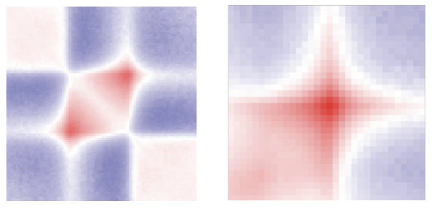

</center>

## Aggregate over variable width regions

By default, if you provide fanc aggregate with a list of regions, it
will extract the square Hi-C sub-matrices along the diagonal for each
region and interpolate them to match the width set by `--pixels` (90 by
default). It will then calculate the average value for each pixel, which
then form the aggregate matrix.

1)  Let’s try this on TADs called using the arrowhead algorithm ([Rao
    and Huntley et al.,
    2014](https://doi.org/10.1016/j.cell.2014.11.021)). `fanc aggregate`
    will ignore all regions in the file that are not present in the Hi-C
    matrix. In our example Hi-C file, that is everything outside of
    chromosomes 18 and 19:

``` r
fanc aggregate output/hic/binned/fanc_example_100kb.hic \
  architecture/domains/gm12878_tads.bed \
  architecture/aggregate/fanc_example_100kb.agg
```

This command only produces an `AggregateMatrix` file
(`fanc_example_100kb.agg`), which is useful for further usage with
FAN-C, but not easily readable.

2)  To extract the aggregate matrix in `.txt` format, simply add `-m`
    and to plot it just use `-p`:

``` r
fanc aggregate output/hic/binned/fanc_example_100kb.hic \
  architecture/domains/gm12878_tads.bed \
  architecture/aggregate/fanc_example_100kb.agg \
  -p architecture/aggregate/fanc_example_100kb.agg.png \
  -m architecture/aggregate/fanc_example_100kb.agg.txt \
  -e -l
```

Important: For variable sized regions, make sure to use the
observed/expected regions by `-e` flag. `-e` works very well with
log2-transformed data (`-l`).

<center>

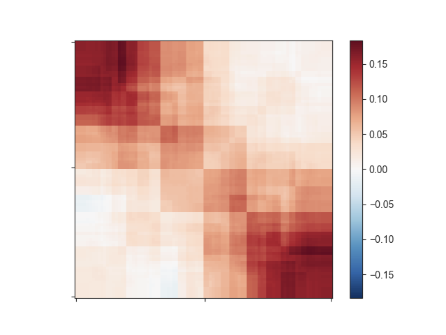

</center>

3)  This still does not look like much of a TAD, but we can add a little
    more context by expanding the plotting region relative to the region
    size using `-r`:

``` r
fanc aggregate output/hic/binned/fanc_example_100kb.hic \
  architecture/domains/gm12878_tads.bed \
  architecture/aggregate/fanc_example_100kb.agg \
  -p architecture/aggregate/fanc_example_100kb_oe_large.agg.png \
  -m architecture/aggregate/fanc_example_100kb_oe_large.agg.txt \
  -e -l -r 1.0
```

<center>

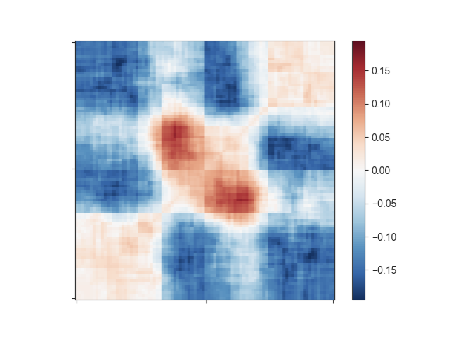

</center>

That plot depicts a region that is 3x the size of the TAD located in its
center and already looks like we would expect: High signal in the
center, especially at the TAD corner, where the corner loops are
typically located.

4)  We can further apply an exponential rescaling (`--rescale`) of the
    data to make this look more like a Hi-C matrix. Here, we are not
    log-transforming the data and we are setting the saturation of the
    pixel values at 0.045 using `--vmax`.

``` r
fanc aggregate output/hic/binned/fanc_example_100kb.hic \
  architecture/domains/gm12878_tads.bed \
  architecture/aggregate/fanc_example_100kb.agg \
  -p architecture/aggregate/fanc_example_100kb_oe_large_res.png \
  -m architecture/aggregate/fanc_example_100kb_oe_large.agg.txt \
  -e -r 1.0 --rescale --vmax 0.045
```

<center>

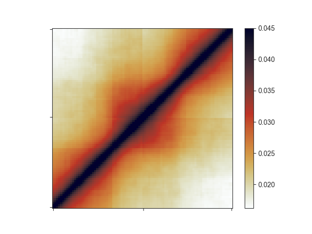

</center>

5)  For both the log2(O/E) and rescaled versions of the aggregate
    matrices, there are pre-set flags you can use called `--tads` and
    `–-tads-imakaev`, respectively. The latter is named after the first
    author of the publication that first used rescaled aggregate
    matrices in this fashion ([Flyamer, Gassler, and Imakaev et al.,
    2017](https://www.nature.com/articles/nature21711)). In the above
    example, you can simply run:

``` r
fanc aggregate output/hic/binned/fanc_example_100kb.hic \
  architecture/domains/gm12878_tads.bed \
  architecture/aggregate/fanc_example_100kb.agg \
  -p architecture/aggregate/fanc_example_100kb_oe_large.agg.png \
  -m architecture/aggregate/fanc_example_100kb_oe_large.agg.txt \
  --tads
```

## Aggregate over fixed width regions

6)  Sometimes, you may want to use a fixed window surrounding a set of
    features in the aggregate analysis, such as TAD boundaries.
    `fanc aggregate` provides the `-w` option to plot the aggregate Hi-C
    matrix in a window of size `w` around the centre of each region in
    the list provided.

``` r
fanc aggregate \
  output/hic/binned/fanc_example_100kb.hic \
  architecture/domains/fanc_example_100kb.insulation_boundaries_score0.7_1mb.bed \
  architecture/aggregate/fanc_example_100kb_boundaries.agg \
  -w 5mb -p architecture/aggregate/fanc_example_100kb_boundaries.agg.png \
  -m architecture/aggregate/fanc_example_100kb_boundaries.agg.txt \
  --vmin 0 --vmax 0.03
```

<center>

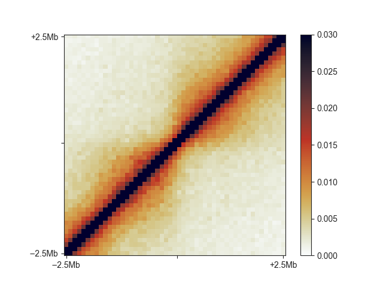

</center>

7)  You can see the relatively faint “average boundary” in the centre of
    the plot. When using O/E and log2-transformed matrices, this becomes
    much more obvious:

``` r
fanc aggregate \
  output/hic/binned/fanc_example_100kb.hic \
  architecture/domains/fanc_example_100kb.insulation_boundaries_score0.7_1mb.bed \
  architecture/aggregate/fanc_example_100kb_boundaries_oe.agg \
  -w 5mb -p architecture/aggregate/fanc_example_100kb_boundaries_oe.agg.png \
  -m architecture/aggregate/fanc_example_100kb_boundaries_oe.agg.txt \
  -e -l
```

## Loops and other pairwise genomic regions

6)  When you have loop calls or other pairwise genomic regions in
    `BEDPE` format, you can use `fanc aggregate` to make aggregate loop
    plots. The pre-set for this is `--loops`. Control the size of the
    plot using the `--pixels` argument.

``` r
fanc aggregate architecture/loops/rao2014.chr11_77400000_78600000.hic \
  architecture/loops/rao2014.chr11_77400000_78600000.loops_no_singlets.bedpe \
  architecture/loops/rao2014.chr11_77400000_78600000.loops_no_singlets.agg \
  -p architecture/aggregate/rao2014.chr11_77400000_78600000.loops_no_singlets.agg.png \
  --loops
```

<center>

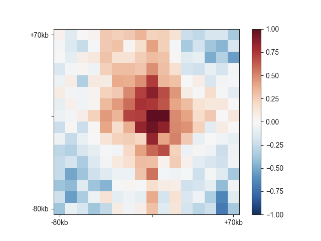

</center>

## Disclaimer

This tutorial is heavily based on the FAN-C documentation available at:

<https://fan-c.readthedocs.io/>
