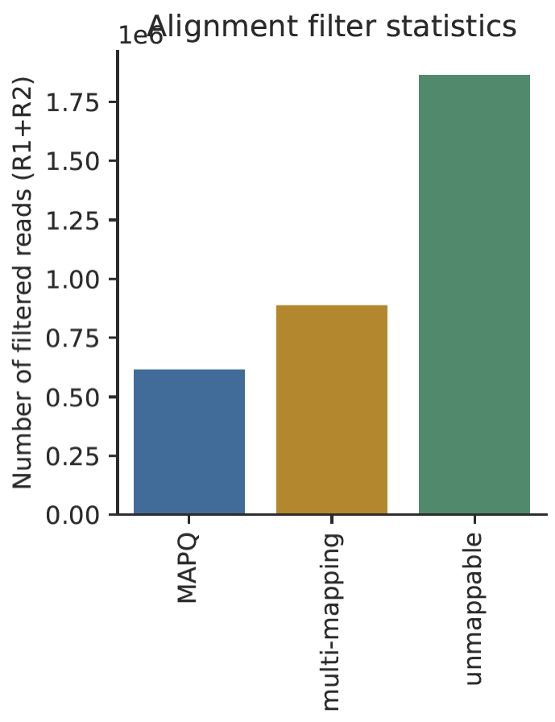

Generating Hi-C matrices
================

<!-- hic_matrix_generation.md is generated from hic_matrix_generation.Rmd. Please edit that file -->

# Introduction

Hi-C (Chromosome conformation capture (3C) combined with deep
sequencing) is a technique used to capture the spatial organisation of
chromatin within the nucleus.

In this tutorial we will learn how to analyse the raw data coming from
these datasets using (mostly) a single tool: FAN-C. By the end of the
tutorial you should be able to generate normalised contact frequency
matrices from your data and derive features such as Compartments,
Insulation scores and Topologically Associating Domains from it.

# Practical 1: Getting started with FAN-C

1)  If you haven’t do so, please start the VirtualBox virtual machine
    for the course on your computer.

2)  FAN-C [(Kruse et al., Genome Biology
    2020)](https://genomebiology.biomedcentral.com/articles/10.1186/s13059-020-02215-9)
    is a python3 module for the analysis of Hi-C data. It is
    pre-installed in the course virtual machine. To install it by
    yourself, we recommend to do so following the [pip installation
    steps](https://fan-c.readthedocs.io/en/latest/getting_started.html#fan-c)
    in:
    <https://fan-c.readthedocs.io/en/latest/getting_started.html#installation>

3)  In order to confirm that FAN-C is properly installed, launch a shell
    window inside the Linux virtual machine. Select the top search icon
    in the left-hand banner, and search for ‘terminal’.

4)  Type the following command into the shell.

``` r
fanc --version
```

5)  You can always access the [help
    section](https://fan-c.readthedocs.io/en/latest/fanc-executable/fanc_basic.html#overview)
    of FAN-C by typing:

``` r
fanc --help
```

6)  FAN-C is itself a toolkit consisting of multiple subcommands for the
    analysis of Chromatin Conformation Capture data. You can explore the
    available analyses in the help message that we obtained above. FAN-C
    provides a convenient subcommand that automates the generation of
    normalised Hi-C matrices from raw FASTQ files called [‘fanc
    auto’](https://fan-c.readthedocs.io/en/latest/fanc-executable/fanc-generate-hic/fanc_auto.html).
    We can access each FAN-C subcommand by typing its name after the
    fanc command like:

``` r
fanc auto
```

7)  The code above should have given us an error due to missing
    arguments needed to run it. In this case, we needed to provide input
    FASTQ files, the name of the restriction enzyme used, the genome
    studied and an output folder. To know the arguments that are needed
    to run each analysis and get a little help on the subcommand of
    interest we can simply type: `fanc <subcommand> --help`. For
    example, we can check the help for `fanc auto` by typing:

``` r
fanc auto --help
```

8)  The help section includes a brief description of the subcommand
    purpose, which we can always extend a bit further by checking the
    [fanc
    documentation](https://fan-c.readthedocs.io/en/latest/fanc.html) in
    <https://fan-c.readthedocs.io/en/latest/fanc.html>

For [fanc
auto](https://fan-c.readthedocs.io/en/latest/fanc-executable/fanc-generate-hic/fanc_auto.html),
the help section includes two types of arguments: `positional` and
`optional` arguments. Some arguments are expected in a specific order
after the subcommand and thus are called `positional` arguments. In
addition to positional arguments, `optional` arguments allow for more
control over the subcommand. In case of `fanc auto` important optional
arguments include specifying the genome and restriction enzymes used.

# Practical 2: Example Hi-C matrix generation with FAN-C

For this example, we are going to use the command `fanc auto` (see
[Generating Hi-C matrices with
fanc](https://fan-c.readthedocs.io/en/latest/fanc-executable/fanc-generate-hic/fanc_auto.html#fanc-auto))
to construct a Hi-C map from a subset of a previously published adrenal
tissue dataset ([SRR4271982 of
GSM2322539](https://www.ncbi.nlm.nih.gov/geo/query/acc.cgi?acc=GSM2322539)).
For this course we have also downloaded K562 Hi-C data which will be
analysed in practical 11 using what we learnt in this example.

1)  Create a working directory and copy the example Hi-C files into it

``` r
# Go to the home directory in the virtual machine
cd

# Create a new working directory called hic
mkdir hic

# move into it
cd hic

# copy the example Hi-C data into this folder
scp /media/manager/examples.zip .

# or download the data from our Keeper repository like: 
# wget -O examples.zip "https://keeper.mpdl.mpg.de/d/147906745b634c779ed3/files/?p=/examples.zip&dl=1" 
# make sure to remove the # symbol from the previous line in order for it to work

# unzip the data and change into the resulting directory
unzip examples.zip
cd examples
```

2)  Now let’s generate a contact frequency matrix using a single
    command. From within the `examples` folder, run:

``` r
fanc auto SRR4271982_chr18_19_1.fastq.gzip \
  SRR4271982_chr18_19_2.fastq.gzip output \
  -g hg19_chr18_19.fa -i hg19_chr18_19/hg19_chr18_19 \
  -n fanc_example -t 4 -r HindIII \
  --split-ligation-junction -q 30 --run-with test
```

The `--run-with test` argument causes `fanc` to only print the commands
it would execute, but to exit before running any processing steps. Use
this to review the pipeline and ensure you chose the right parameters
and that there are no errors.

When you remove the `--run-with test` argument, `fanc` will work through
the pipeline. On a modern desktop computer with at least four computing
cores the command should take less than 30 minutes to finish. It will
generate several binned, bias-corrected Hi-C matrices from the FASTQ
input.

3)  Run fanc on the example data by removing the `--run-with test`
    argument from the command above. (**THIS STEP WILL TAKE ~30
    MINUTES.**) Leave this process running and open a new terminal to
    work with in the meantime. You can read details about `fanc auto`
    and all of its parameters in [Generating Hi-C matrices with
    fanc](https://fan-c.readthedocs.io/en/latest/fanc-executable/fanc-generate-hic/fanc_auto.html#fanc-auto).

4)  `fanc auto` will generate the following folder structure in the
    output folder:

``` r
output
├── fastq
├── sam
├── pairs
├── hic
│   └── binned
└── plots
    └── stats
```

You can check it by exploring the output folder in a new terminal
window:

``` r
cd ~/hic/examples/
ls -R output/
```

The processed `.bam`, `.pairs` and `.hic` files will be added in these
folders after completion of the pipeline.

5)  Check the output `.bam` file as soon as it is ready by typing

``` r
samtools view output/sam/SRR4271982_chr18_19_1.bam | head
```

Congratulations! You have generated your first Hi-C matrix.

# Practical 3: Example visualisation with fancplot

1)  We can plot the newly generated Hi-C maps easily using the fancplot
    command. Simply execute:

``` r
fancplot chr18:63mb-70mb -p triangular -vmax 0.05 \
  output/hic/binned/fanc_example_100kb.hic
```

This will plot the region 63-70Mb of chromosome 18 in the familiar Hi-C
plot. Note that this dataset is very small and hence the quality of the
matrix not particularly great - but TADs are clearly visible.

2)  You can find details about the plotting executable `fancplot` in
    [Basic
    usage](https://fan-c.readthedocs.io/en/latest/fancplot-executable/fancplot_basic.html#fancplot-executable).
    Or by typing

``` r
fancplot --help
```

Similar to the fanc command, we can access the help section for each
plot type by adding the plot type before the `help` argument:

``` r
      fancplot -p triangular --help
```

3)  Scroll around the genome and save a `.png` image using the
    interactive window.

4)  Alternatively, we can save the plot directly in pdf format by
    specifying an `--output` argument like:

``` r
fancplot chr18:63mb-70mb \
  --output output/plots/Figure1_test.pdf \
  -p triangular -vmax 0.05 \
  output/hic/binned/fanc_example_100kb.hic
```

# Practical 4: Understanding individual steps of the fanc auto pipeline - mapping

The following schematic will give you an overview of what file types
fanc auto can handle and how they are processed downstream.

<center>


</center>

`fanc auto` will map reads in `FASTQ` (or gzipped `FASTQ`) files to a
reference genome, generating `SAM/BAM` files. `SAM/BAM` files with
paired-end reads will be automatically sorted and mate pairs will be
matched to generate `Pairs` files. `Pairs` files will be converted into
fragment-level `Hic` objects. Multiple fragment-level `Hic` objects will
be merged into a single Hi-C object. Finally, the fragment-level `Hic`
object will be binned at various bin sizes.

Internally, `fanc auto` constructs its Hi-C processing pipeline from
more specialised `fanc` commands. When describing the different pipeline
steps and how you can control them below, we will also reference the
specialised command that is used to build each step of the pipeline.

1)  Check again the individual steps performed by fanc auto by running

``` r
fanc auto SRR4271982_chr18_19_1.fastq.gzip \
  SRR4271982_chr18_19_2.fastq.gzip output2 \
  -g hg19_chr18_19.fa -i hg19_chr18_19/hg19_chr18_19 \
  -n fanc_example -t 4 -r HindIII \
  --split-ligation-junction -q 30 --run-with test
```

Three major steps constitute the core of the pipeline: `fanc map`,
`fanc pairs` and `fanc hic`. To (iteratively) map FASTQ files directly
with FAN-C, use the [fanc
map](https://fan-c.readthedocs.io/en/latest/fanc-executable/fanc-generate-hic/fanc_modular_steps.html#fanc-map-mapping-fastq-files)
command.

2)  Here is a minimal example: (**DO NOT RUN**)

``` r
fanc map SRR4271982_chr18_19_1.fastq.gzip \
   bwa-index/hg19_chr18_19.fa \
   SRR4271982_chr18_19_1.sam
```

fanc map will autodetect if you supply a BWA or Bowtie2 index, so the
following command would use Bowtie2 as a mapper: (**DO NOT RUN**)

``` r
fanc map SRR4271982_chr18_19_1.fastq.gzip \
      hg19_chr18_19/hg19_chr18_19 \
      SRR4271982_chr18_19_1.sam
```

You can change the suffix of the output file to `.bam` and `fanc map`
will automatically convert the mapping output to `BAM` format.

3)  Because of the chimeric nature of Hi-C fragments, `fanc auto`
    performs iterative mapping as a default: Reads are initially trimmed
    to 25bp (change this with the `-m` option) before mapping, and then
    iteratively expanded by 10bp (change the step size with the `-s`
    option) until a unique, high quality mapping location can be found.
    The associated quality cut-off is **3 for BWA** and **30 for
    Bowtie2**, but can be changed with the `-q` parameter. (**DO NOT
    RUN**)

``` r
# expand by 5bp every iteration and accept lower quality
fanc map SRR4271982_chr18_19_1.fastq.gzip \
      bwa-index/hg19_chr18_19.fa \
      SRR4271982_chr18_19_1.sam -m 20 -s 5 -q 10
```

4)  BWA will automatically split chimeric reads and return both mapping
    locations. This is especially useful for Hi-C data, as reads are
    often sequenced through a ligation junction, which BWA can often
    detect automatically. Nonetheless, mapping may be improved by
    splitting reads at predicted ligation junctions from the start. To
    enable this, use the `-r` parameter and supply the name of a
    restriction enzyme (e.g. HindIII or MboI). The name will be used to
    look up the enzyme’s restriction pattern, predict the sequence of a
    ligation junction, and split reads at the predicted junction before
    mapping starts. Reads split in this manner will have an additional
    attribute in the `SAM/BAM` file `ZL:i:\<n\>` where `\<n\>` is an
    integer denoting the part of the split read. (**DO NOT RUN**)

``` r
# Split reads at HindIII ligation junction before mapping
fanc map SRR4271982_chr18_19_1.fastq.gzip \
      bwa-index/hg19_chr18_19.fa \
      SRR4271982_chr18_19_1.sam -t 16 -r HindIII
```

Final practical arguments to speed up the mapping. We can assign more
threads to the mapping process using the `-t` parameter. If you are
using Bowtie2, you can additionally use the `--memory-map` option, which
will load the entire Bowtie2 index into memory to be shared across all
Bowtie2 processes. Use this option if your system has a lot of memory
available to speed up the mapping. Finally, if you are using the `-tmp`
option, which causes `fanc auto` to perform most pipeline steps in a
temporary directory, you may want to use the `--split-fastq` option to
split the FASTQ files into smaller chunks before mapping, so you can
save space on your tmp partition. In practice, most of these parameters
have sensible defaults in `fanc auto`. You might want to enforce
iterative mapping to increase the number of reads recovered and increase
the number of threads to be used. Or you might switch to BWA mapping
which doesn’t need iterative mapping.

# Practical 5: fanc pairs: Generating and filtering read Pairs

The `fanc pairs` command handles the creation and modification of Pairs
objects, which represent the mate pairs in a Hi-C library mapped to
restriction fragments. Possible inputs are: two SAM/BAM files
(paired-end reads, sorted by read name), a [HiC-Pro valid pairs
file](https://nservant.github.io/HiC-Pro/RESULTS.html#list-of-valid-interaction-products),
a [4D Nucleome pairs
file](https://github.com/4dn-dcic/pairix/blob/master/pairs_format_specification.md),
or an existing FAN-C Pairs object.

To process SAM/BAM files, no additional external software is required.
However, we do recommend the installation of Sambamba, which can greatly
speed up the SAM sorting step required for merging mate pairs into the
Pairs object.

1)  A minimal `fanc auto` command using `SAM/BAM` files could look like
    this: (**DO NOT RUN**)

``` r
fanc auto output/sam/SRR4271982_chr18_19_1.bam \
      output/sam/SRR4271982_chr18_19_2.bam \
      output2/ -g hg19_chr18_19_re_fragments.bed
```

2)  while minimal `fanc pairs` command using `SAM/BAM` files could look
    like this: (**DO NOT RUN**)

``` r
fanc pairs output/sam/SRR4271982_chr18_19_1_sort.bam \
      output/sam/SRR4271982_chr18_19_2_sort.bam \
      output/pairs/SRR4271982_chr18_19.pairs \
      -g hg19_chr18_19_re_fragments.bed
```

The `-g` or `--genome` parameter is mandatory, and is used to load (or
construct) the restriction fragment regions necessary for building the
fragment-level Hi-C object. You can either directly provide a
region-based file with restriction fragments (most file formats are
supported, including BED and GFF), or use a FASTA file with the genomic
sequence in conjunction with the `-r` or `--restriction-enzyme`
parameter. In the latter case, fanc auto will perform an in silico
digestion of the genome and use the resulting restriction fragments from
there.

# Practical 6: Pair-level filtering

`fanc pairs` provides a lot of parameters for filtering read pairs
according to different criteria. By default, if not specified otherwise,
no filtering is performed on the read pairs (passthrough). Typically,
however, you will at least want to filter out unmappable (`-m`) and
multimapping reads (`-u` or `-us`). It is also a good idea to filter by
alignment quality (-q `<n>`). Good cutoffs for Bowtie2 and BWA are 30
and 3, respectively. If you suspect your Hi-C library to be contaminated
by DNA from a different organism, you can align your original reads to a
different genome and pass the resulting `SAM/BAM` file to the `-c`
parameter (ensure no unmappable reads are in the file!). This will
filter out all reads that have a valid alignment in the putative
contaminants genome (by qname). All of the above filters operate on
single reads, but will filter out the pair if either of the reads is
found to be invalid due to a filtering criterion.

1)  while minimal fanc pairs command using `SAM/BAM` files could look
    like this: (**DO NOT RUN**)

``` r
fanc pairs output/sam/SRR4271982_chr18_19_1_sort.bam \
      output/sam/SRR4271982_chr18_19_2_sort.bam \
      output/pairs/SRR4271982_chr18_19.pairs \
      -g hg19_chr18_19_re_fragments.bed \
      -us \
      -q 3
```

2)  You can actually check how many pairs were filtered at this step by
    checking the statistics plots being generated in the output folder
    (see plot below).

``` r
ls output/plots/stats/fanc_example.pairs.stats.pdf
```

<center>



</center>

3)  An additional set of filters operates on the properties of the read
    pair. You may want to filter out self-ligated fragments, which
    provide no spatial information with the -l parameter. As Hi-C
    experiments generally rely on PCR amplification, it is expected to
    find a lot of PCR duplicates in the library. You can filter those
    with the -p \<n\> parameter, where \<n\> denotes the distance
    between the start of two alignments that would still be considered a
    duplicate. Normally you would use 1 or 2, but you can use higher
    values to be more stringent with filtering. (**DO NOT RUN**)

``` r
fanc pairs output/pairs/SRR4271982_chr18_19.pairs \
      -l  # filter self-ligated fragments \
      -p 2  # filter PCR duplicates mapping within 2bp
```

4)  You can also check how many pairs were filtered at this step by
    checking the statistics plots being generated in the output folder
    (See the plot on the right)

<center>


</center>

5)  Depending on the experimental setup, it is sometimes expected to
    find valid Hi-C alignments near restriction sites. You can filter
    read pairs for their (cumulative) distance to the nearest
    restriction sites using the -d parameter. To determine that cutoff,
    or to detect any issues with the Hi-C library, you can first use the
    –re-dist-plot parameter. Note that this will only plot a sample of
    10,000 read pairs for a quick assessment: (**DO NOT RUN**)

``` r
fanc pairs --re-dist-plot re-dist.png \
     output/pairs/SRR4271982_chr18_19.pairs
```

6)  You can find this plot already generated as part of the fanc auto
    pipeline in

``` r
ls output/plots/stats/fanc_example.pairs.re_dist.pdf
```

<center>


</center>

7)  [Jin et al. (2013)](https://www.nature.com/articles/nature12644)
    have identified several errors that stem from incomplete digestion
    and which can be identified from different types of ligation
    products. You can filter these using the -i \<n\> and -o \<n\>
    parameters, for the inward and outward ligation errors,
    respectively. If you need help finding a good cut-off, you may use
    the –ligation-error-plot parameter. (**DO NOT RUN**)

``` r
fanc pairs --ligation-error-plot ligation-err.png \
     output/pairs/SRR4271982_chr18_19.pairs
```

8)  You can also find this plot already generated as part of the fanc
    auto pipeline in

``` r
ls output/plots/stats/fanc_example.pairs.ligation_error.pdf
```

<center>


</center>

Usually 1-10kb are often reasonable cut-offs. You can also let FAN-C
attempt to find suitable cut-offs based on the over-representation of
certain ligation products using the –filter-ligation-auto parameter, but
this is not always 100% reliable.

# Practical 7: fanc hic: Generating, binning, and filtering Hic objects

The fanc hic command is used to generate fragment-level and
binned+filtered Hi-C matrices.

1)  You can use FAN-C Pairs files as input for fanc hic: (**DO NOT
    RUN**)

``` r
fanc hic \
      output/pairs/SRR4271982_chr18_19.pairs \
      output/hic/fragment_level.hic
```

Without additional parameters, this will generate a fragment-level Hic
object and exit. Multiple Pairs files will be converted into
fragment-level Hic objects which are then merged into a single object.

If you already have a fragment-level Hic file and you want to bin it, or
perform filtering or matrix balancing, you can also use this as input:

2)  You can use FAN-C Pairs files as input for fanc hic: (**DO NOT
    RUN**)

``` r
fanc hic \
      output/hic/fragment_level.hic \
      output/hic/binned/example_1mb.hic -b 1mb
```

You can use the -b parameter to bin the fragment-level Hi-C matrix. You
can either use integers (1000000) or common abbreviations (1Mb). The
filtering steps outlined below only apply to binned Hic matrices.

# Practical 8: Filtering and balancing

fanc hic provides a few filtering options. Most likely you want to apply
a coverage filter using -l to specify a coverage threshold in absolute
number of pairs per bin, or -r to apply a coverage threshold based on a
fraction of the median number of pairs pair bin. -a is simply a pre-set
for -r 0.1.

For some applications it might be useful to remove the prominent Hi-C
diagonal. You can use the -d \<n\> parameter to remove all pairs in
pixels up to a distance of n from the diagonal.

You can balance your Hi-C matrices using the -n parameter. By default,
this applies Knight-Ruiz (KR) balancing to each chromosome. You can opt
for another normalisation method using –norm-method, for example
–norm-method ice for ICE balancing, or –norm-method vc for vanilla
coverage normalisation (which in this case is equivalent of a single ICE
iteration). We typically recommend KR balancing for performance reasons.
Each chromosome in the matrix is corrected independently, unless you
specify the -w option.

Finally, you can output the filtering statistics to a file or plot using
the -s and –statistics-plot parameters, respectively.

1)  You can find this plot already generated as part of the fanc auto
    pipeline in:

``` r
ls output/plots/stats/fanc_example_*.stats.pdf
```

<center>


</center>

# Practical 9: Quality control: cis/trans ratio

A useful metric to assess the quality of a Hi-C experiment is the ratio
between Hi-C contacts happening between loci inside the same chromosome
(*cis*) and contacts happening between fragments in different
chromosomes (*trans*). Problems with suboptimal fixation would lead to a
loss of *cis* interactions and a gain of *trans* interactions.
Additionally, problems with and excess of ligations would lead to an
artificial increase in *trans* contacts.

1)  FAN-C provides a tool to calculate the cis/trans metric and to run
    it you can just run:

``` r
fanc cis-trans output/hic/binned/fanc_example_1mb.hic
```

Please note that this is a normalised cis/(cis+trans) ratio, so it
corresponds to the percentage of cis interactions. It ranges from 0
to 1. The closest to 1, the better.

For this toy example, we are only using read pairs for which either end
maps to chr18 or chr19, so the cis/trans ratio is bound to be
artificially high since we are missing many inter-chromosomal contacts.

# Practical 10: Working with Cooler, Juicer, and text files

FAN-C is fully compatible with Hi-C files from Cooler (`.cool` and
`.mcool`) and Juicer (`.hic`). There is no need to convert them to FAN-C
format, you can use them directly in any `fanc` command. Text files,
such as HiC-Pro output or 4D Nucleome pairs files must be converted to
FAN-C format before they can be used in any commands. **IMPORTANT**:
Please note that juicer’s `.hic` format is not the same as FAN-C’s
`.hic` format.

1)  To convert our format to either cooler’s multi-resolution `.cool`
    format or juicer’s `.hic` format you can simply:

``` r
fanc to-cooler \
    output/hic/binned/fanc_example_1mb.hic \
    output/hic/binned/fanc_example_1mb.cool
```

2)  or:

``` r
fanc to-juicer \
    output/hic/binned/fanc_example_1mb.hic \
    output/hic/binned/fanc_example_1mb.juicer.hic
```

After doing that you will also be able to use all the tools associated
to these formats. For example, look at the multiple resolution matrices
stored in them:

``` r
cooler tree output/hic/binned/fanc_example_1mb.cool
cooler ls output/hic/binned/fanc_example_1mb.cool
```

Once we have transformed our data in cooler format, we can visualise it
in HiGlass ([Kerpedjiev et al.,
2018](https://genomebiology.biomedcentral.com/articles/10.1186/s13059-018-1486-1)),
a tool able to visualise dynamically Hi-C data. For this course, the
people at Wellcome Connecting Science have already kindly installed the
higlass-manage tool for you, but if you need to install it in your own
computer follow the instructions in
<https://docs.higlass.io/tutorial.html>. If you need it in a server
install [higlass-server](https://github.com/higlass/higlass-server)
instead. There is a great tutorial to use HiGlass in
<https://hms-dbmi.github.io/hic-data-analysis-bootcamp/#24>

3)  In order to visualise our matrix in HiGlass (and if Docker is
    running) we need to first start HiGlass:

``` r
higlass-manage start
# navigate to http://localhost:8989/app in firefox     
```

HiGlass already has available multiple processed cooler files, gene
annotations and genome coordinates for easy use. We can add either of
these by clicking on the plus button.

4)  As a test, load the Rao 2014 K562 Hi-C map analysed with the hg19
    genome

5)  Add Gene annotations, genome coordinates and epilogos tracks by
    clicking on plus and typing hg19

6)  Enable toggle position search box and navigate to your favourite
    gene by typing the name of it in the navigation bar to the right of
    ‘hg19’.

7)  Now, let’s compare this with our analysed file by ingesting it
    using:

``` r
higlass-manage ingest \
      --assembly hg38 \
      output/hic/binned/fanc_example_1mb.cool
```

You can now load it using the plus sign in firefox.

# Practical 11: K562 Hi-C data analysis. Setting up.

We will now analyse K562 Hi-C data generated by [Moquin et al
2018](https://journals.asm.org/doi/10.1128/JVI.01413-17). This data is
stored in the Gene Expression Database (GEO) database under the
accession number
[GSE98120](https://www.ncbi.nlm.nih.gov/geo/query/acc.cgi?acc=GSE98120).
At this point we have two analysis options. Depending on how fast we
were on the first 10 exercises we will run fanc auto either in A. the
entire K562 dataset, or B. in a subset of the data for chromosomes 18
and 19. We can also split in groups that do each and compare results at
the end. Please, modify the commands below to point to the correct
.fastq.gz files.

## Option A.

1)  Sequence Read Archives (SRA) files should be available in the shared
    folder under `~/LowInput_CourseData/HI_C/`. These SRA files were
    downloaded using commands like: (**DO NOT RUN**)

``` r
wget https://sra-pub-run-odp.s3.amazonaws.com/sra/SRR5470534/SRR5470534
wget https://sra-pub-run-odp.s3.amazonaws.com/sra/SRR5470534/SRR5470535
wget https://sra-pub-run-odp.s3.amazonaws.com/sra/SRR5470534/SRR5470536
wget https://sra-pub-run-odp.s3.amazonaws.com/sra/SRR5470534/SRR5470537
```

2)  We can convert the downloaded SRA files into FASTQ files using the
    sratoolkit like: (**This will take ~15-20 minutes to run, pick one
    of the SRA files and follow this tutorial with it.**)

``` r
cd ~/LowInput_CourseData/HI_C/
gzip -d SRR5470534.gz
fastq-dump --outdir ./ --gzip --split-3 SRR5470534
```

The fastq-dump command will split the SRA file into two .fastq files if
the library is pair-ended or a single .fastq file if it is a single-end
library. Additionally, it will save space by compressing them into .gzip
format.

3)  As mentioned earlier in the course, it is always a good idea to run
    fastQC on any next-generation sequencing library to spot potential
    technical problems with adaptor contaminations and remove them
    beforehand:

``` r
mkdir fastqc
fastqc -o fastqc/ SRR5470534_1.fastq.gz
fastqc -o fastqc/ SRR5470534_2.fastq.gz
```

4)  Examine the fastQC output. How big are they? Are they any good?
    Should we run adaptor trimming on them?

## Option B.

A subset of this data for this accession number can be found either in
your Virtual Machine shared folder in a compressed folder called
`K562.zip` or online in our shared Keeper library:
<https://keeper.mpdl.mpg.de/d/9b1c1788f97642a188f3/>

1)  If not available in the shared folder, please download each subset
    .fastq file into your computer by clicking on the sample that you
    will focus on. Now, as recommended for any new dataset we get, let’s
    assess the quality of the .fastq files using a tool such as FASTQC:

``` r
mkdir fastqc
fastqc -o fastqc/ SRR5470534_1.chr18_chr19.fastq.gz
fastqc -o fastqc/ SRR5470534_2.chr18_chr19.fastq.gz
```

2)  Examine the fastQC output. How big are they? Are they any good?
    Should we run adaptor trimming on them?

# Practical 12: Running FAN-C

As we did in practical number 2, we can run the entire FAN-C pipeline
with the fanc auto command. We need to make a couple of adjustments to
make sure that FAN-C runs smoothly. Option A. (1) This is code that we
usually use to analyse new Hi-C files in our lab. Can you spot the 7
changes that we made to the example in practical number 2? (**DO NOT
RUN** YET)

``` r

GENOME='/Genomes/UCSC/hg38/Sequence/hg38.negspy.fa' # This file is not provided here
GENOMEIDX='/Genomes/ UCSC/hg38/BWAIndex/hg38.negspy.fa' # This file is not provided here
mkdir hic_BWA
fanc auto \
      SRR5470534_1.fastq.gz \
      SRR5470534_2.fastq.gz \
      hic_BWA/SRR5470534/ \
      --genome $GENOME \
      --restriction-enzyme MboI \
      --genome-index $GENOMEIDX \
      --basename SRR5470534 \
      --threads 16 \
      --le-inward-cutoff 5000 \
      --le-outward-cutoff 5000 \
      -tmp --split-ligation-junction -f
```

Here is the fanc command from practical number 2 for comparison:

``` r
fanc auto SRR4271982_chr18_19_1.fastq.gzip \
      SRR4271982_chr18_19_2.fastq.gzip output \
      -g hg19_chr18_19.fa -i hg19_chr18_19/hg19_chr18_19 \
      -n fanc_example -t 4 -r HindIII \
      --split-ligation-junction -q 30
```

# Answers

1.  For this analysis, we switched to using the full hg38 genome instead
    of only two hg19 chromosomes. It’s always a good idea to use the
    most recent version of the genome! Please note that we additionally
    changed the order of the chromosomes to match the [negspy
    repository](https://github.com/pkerpedjiev/negspy/blob/master/negspy/data/hg38/chromInfo.txt)
    for compatibility down the line with HiGlass.
2.  We switched to using BWA as a mapping algorithm. (In our hands this
    mapper recovers a higher proportion of aligned reads without
    iterative mapping.)
3.  We changed the restriction enzyme since these libraries were
    generated using MboI instead of HindIII
4.  We increased the number of cores that FAN-C was be able to use in
    parallel to increase efficiency. This made it possible to finish in
    a couple of hours. (And ran this in a computer cluster.) In a normal
    computer it would take a minimum of 4-6 h. 5-6. We manually
    specified the inward and outward thresholds for pair-level
    filtering. (If in doubt, thresholds between 5-10k are usually ok but
    it is important to confirm with the inward-outward plot.)
5.  We changed the mapping quality (MAPQ) threshold needed for reads to
    be counted as valid alignments (-q). This is because [BWA and
    Bowtie2 MAPQ scores have different
    ranges](https://sequencing.qcfail.com/articles/mapq-values-are-really-useful-but-their-implementation-is-a-mess/).
    In our experience, -q 3 works best for filtering multi-mapping reads
    when using BWA, while -q 30 works best for Bowtie2. (**DO NOT RUN**
    YET)

``` r
# GENOME='/Genomes/Homo_sapiens/UCSC/hg38/Sequence/hg38.negspy.fa'
# GENOMEIDX='/Genomes/Homo_sapiens/UCSC/hg38/BWAIndex/hg38.negspy.fa'

GENOME='~/hic/examples/hg19_chr18_19.fa'
GENOMEIDX='~/hic/examples/bwa-index/hg19_chr18_19.fa'

mkdir hic_BWA

fanc auto \
      SRR5470534_1.fastq.gz \
      SRR5470534_2.fastq.gz \
      hic_BWA/SRR5470534/ \
      --genome $GENOME \
      --restriction-enzyme MboI \
      --genome-index $GENOMEIDX \
      --basename SRR5470534 \
      --threads 16 \
      --le-inward-cutoff 5000 \
      --le-outward-cutoff 5000 \
      --split-ligation-junction -q 3 -f
```

As a note, binned `.hic` files and stat plots that result from running
the above pipeline can be found in our shared Keeper library.

IMPORTANT: For people following option A, change the number of threads
to 4, run the command above and wait. (You can find the result files
from running fanc in this mode already either in your Virtual Machine
shared folder or in our shared keeper library:
<https://keeper.mpdl.mpg.de/d/9b1c1788f97642a188f3/>)

For people following option B change the `GENOME` variable to the
absolute path of the FASTA file (hg19_chr18_19.fa) and `GENOMEIDX`
variable to the absolute path of the (bwa-index/hg19_chr18_19.fa) in the
examples folder. Then change the paths to the subset fastq files you
chose and change the number of threads to 4, run the command above and
wait.

For the steps in the next tutorial, please use the results from this
step to perform the rest of the analysis.

# Practical 13: Quality control

1)  Calculate the inward/outward ligation error plot.

``` r
fanc pairs \
      --ligation-error-plot \
      SRR5470534.pairs.ligation_error.pdf \
      SRR5470534.pairs
```

Is it ok that we filter out any inward or outward interactions happening
among DNA loci \<5000 bp apart? Or should we have used smaller
thresholds to retain more reads?

2)  Look at the read pair filter statistics plot generated as part of
    `fanc auto`. How does this library compare to the one used in the
    first example?

3)  Calculate cis-trans ratios on the 2mb (or 1mb) binned matrix.

``` r
fanc cis-trans SRR5470534_2mb.hic
```

Are these scores indicative of a good library or a bad one? Can you see
a difference if you calculate the same score in higher resolution
matrices?

``` r
fanc cis-trans SRR5470534_1mb.hic
```

# Practical 14: Plotting

1)  Plot the same region that we looked at 100 kb resolution. Can you
    see a significant difference with the first matrix? Is this library
    sequenced to a higher sequencing depth?

``` r
fancplot chr18:63mb-70mb \
      --output Figure2_100kb.png \
      -p triangular -vmax 0.05 \
      SRR5470534_100kb.hic
```

2)  Plot the same region at 500 or 50 kb resolution. Is the data of
    enough quality to be visualised at these resolutions?

# Disclaimer

This tutorial is heavily based on the FAN-C documentation available at:

<https://fan-c.readthedocs.io/>
